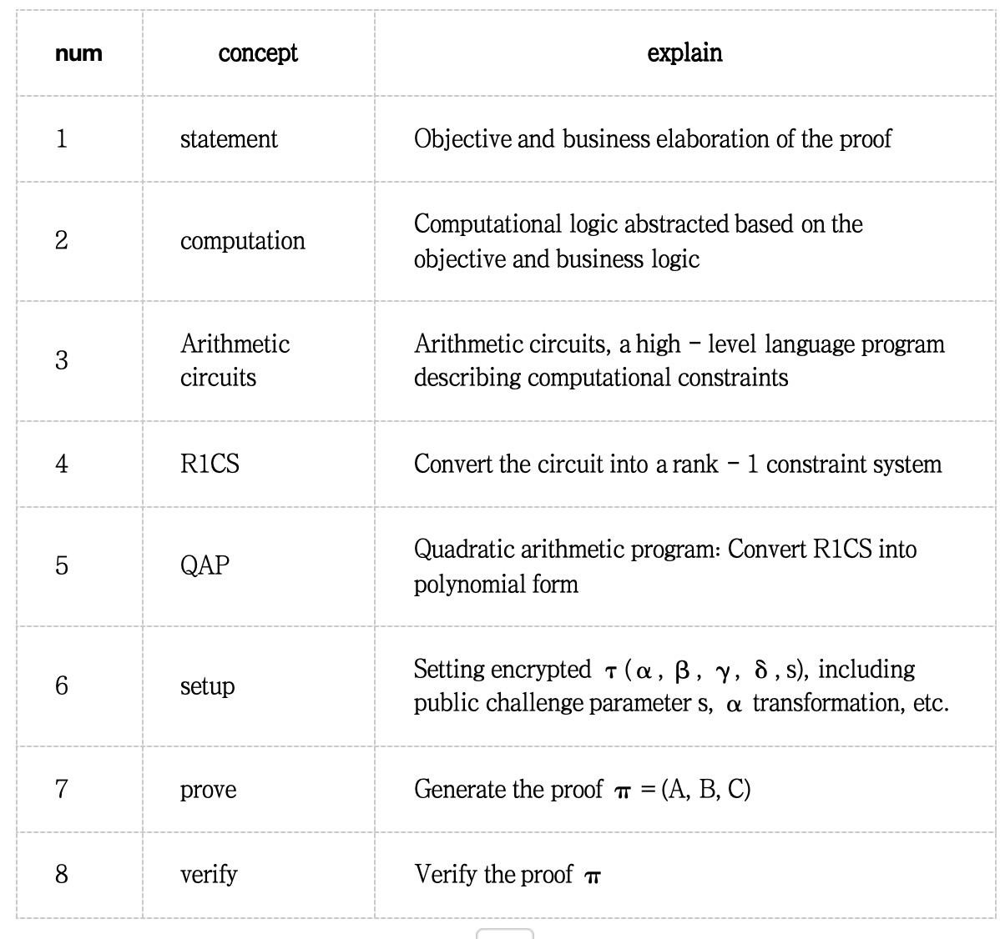

# basic concepts
* R1CS: Represents computational problems as a set of linear constraints, using matrices and vectors. It is suitable for converting programs into a verifiable form.
* QAP: Converts R1CS constraints into polynomial representations. By leveraging the properties of polynomials, it is more convenient in zero-knowledge proofs, especially when using polynomial commitment schemes. It enables more efficient verification and proof generation, utilizing features like efficient polynomial evaluation and interpolation.

Simply put, given a series of x/y correspondences, they can be expressed as a polynomial through Lagrange interpolation. In the R1CS representation, the U/V/W polynomials are naturally represented using the Lagrange basis, rather than in terms of polynomial coefficients.
Before converting R1CS to QAP, the existing constraints must be augmented by adding constraints like ai×0=0. The reason for adding these constraints is to ensure that the polynomials in the resulting QAP are not linearly dependent.

* CRS (Common Reference String): It is the common reference string in a zero-knowledge proof system, a relatively general concept. It provides common random elements for both the prover and the verifier, used in proof generation and verification. A trusted setup is required to ensure security.
* SRS (Structured Reference String): It is a structured form of CRS, optimized for specific zero-knowledge proof protocols. The organization and structure of its elements help improve the performance and security of the proof system, and it has more advantages when using polynomial commitments and specific proof protocols.

* KZG
    * It is an efficient polynomial commitment scheme based on elliptic curve cryptography. It allows the prover to make concise commitments and proofs for polynomials, and the verifier verifies through pairing operations on elliptic curves. It is suitable for zero-knowledge proof systems that require efficient polynomial commitments.
    * Advantages include conciseness and relatively efficient proof and verification. Disadvantages are the need for a trusted setup (CRS or SRS), and in some cases, possible concerns about the performance and security of pairing operations.
* FRI
    * It is a protocol for proving the low-degree property of polynomials. It generates concise proofs through folding operations and Reed-Solomon encoding, which can be used to reduce the size and complexity of proofs.
    * Advantages are that it does not rely on pairing operations, is suitable for proving the low degree of polynomials, and can be used in combination with other zero-knowledge proof protocols. Disadvantages are that it is usually interactive, may require multiple interactions in some cases, and the proof size and verification complexity may be relatively high.
1. Computation Trace — Execute the program, save all intermediate values and final computation results, and generate a polynomial.
2. Low Degree Extension (lde) — Insert some values according to polynomial calculation rules in the computation results.
3. Commitment — Submit all intermediate values and final computation results.
4. Constraint — Construct mathematical constraints that the Trace needs to satisfy for constraint calculation.
5. Composition Polynomial — Combine multiple constraint polynomials together.
6. FRI — Detect whether the polynomial is the original one, instead of constructing a new complex polynomial for constraint deception.

* Root: The roots of a polynomial are those x-values that make the polynomial equal to 0.
* Coefficient: The numerical factor of each term in a polynomial.
* Degree: The degree of the highest-degree term in a polynomial.
* Polynomial Interpolation: Infer a polynomial through the known values of the polynomial at several points.
* Evaluation: Substitute a value into a polynomial and calculate the value of the polynomial.
* Evaluation Domain: The evaluation domain of a polynomial is the interval where the polynomial can be evaluated. It can be regarded as an array of x-values.

* Zero-knowledge proof allows the prover to convince the verifier that a certain statement is true without revealing any specific information to the verifier.
* Zero-Knowledge Proof (ZKP): A cryptographic protocol that proves the correctness of a statement without revealing the underlying secret.
* First proposed by Goldwasser, Micali, and Rackoff in the 1980s for solving specific problems.
* ZKP must satisfy three core properties: completeness, soundness, and zero-knowledge.
* Interactive ZKP Protocols
    * Example: Schnorr Protocol verifies ownership of a private key through multi-round interactions.
* Non-Interactive ZKP (NIZK)
    * Reduces interaction via the Fiat-Shamir Transform, enabling offline proof generation and public verification