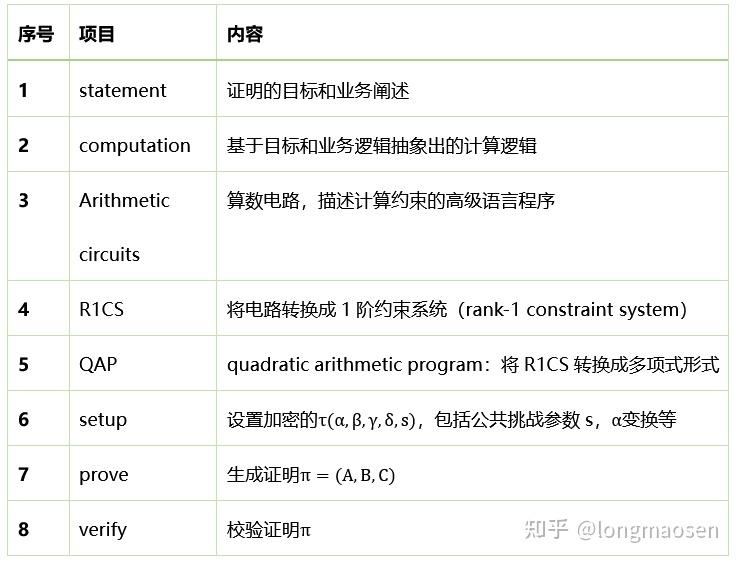

# 基本概念

* R1CS：将计算问题表示为一组线性约束，使用矩阵和向量表示，适用于将程序转换为可验证的形式。
* QAP：将 R1CS 约束转换为多项式表示，利用多项式的性质，在零知识证明中，特别是使用多项式承诺方案时更方便，可提供更高效的验证和证明生成，利用多项式的高效求值和插值等特性。

简单的说，在给定一系列的x/y的对应关系后，可以通过拉格朗日插值表示成多项式。在R1CS的表达方式下，U/V/W多项式很自然用拉格朗日basis表示，并不是以多项式的系数表示。
在R1CS转化为QAP之前，必须对现有约束进行增强，增加ai*0=0的约束。增加这些约束的原因是为了保证转化后的QAP的各个多项式不线性依赖。

* CRS：是零知识证明系统中的公共参考字符串，是一个较为通用的概念，为证明者和验证者提供公共的随机元素，用于证明的生成和验证，需要进行可信设置以确保安全性。
* SRS：是 CRS 的一种结构化形式，针对特定的零知识证明协议进行了优化，其元素的组织和结构有助于提高证明系统的性能和安全性，在使用多项式承诺和特定证明协议时更具优势。

* KZG：
    * 是一种高效的多项式承诺方案，基于椭圆曲线密码学，允许证明者对多项式进行简洁承诺和证明，验证者通过椭圆曲线的配对操作进行验证，适用于需要高效多项式承诺的零知识证明系统。
    * 优点是简洁性和相对高效的证明和验证，缺点是需要可信设置（CRS 或 SRS），并且在某些情况下可能受到对配对操作的性能和安全性的担忧。
* FRI：
    * 是一种用于证明多项式低度性的协议，通过折叠操作和 Reed-Solomon 编码来生成简洁证明，可用于降低证明的大小和复杂度。
    * 优点是不依赖于配对操作，适用于证明多项式的低度性，可与其他零知识证明协议结合使用；缺点是通常是交互式的，在一些情况下可能需要多次交互，且证明的大小和验证的复杂性可能相对较高

1. 计算轨迹 (Computation Trace) — 执行程序，保存所有的中间值和最终计算结果，生成一个多项式。
2. 低度拓展 (Low Degree Extension，lde) — 在计算结果中，按照多项式计算规律插入一些值。
3. 承诺 (Commitment) — 提交所有的中间值和最终计算结果
4. 约束 (Constraint) — 构建数学上的约束，需要Trace满足约束计算
5. 组合多项式 (Composition Polynomial) — 将多个约束多项式组合在一起
6. FRI (FRI) — 检测多项式是否是原来的多项式，而不是构建了一个新的复杂的多项式来进行约束欺骗。

* 根（Root）：多项式的根是让多项式等于0的那些x值。
* 系数（Coefficient）：多项式中每个项的数字因子。
* 次数（Degree）：多项式中最高次项的次数。
* 多项式插值：通过已知的多项式在某几个点的值，来推断多项式。
* 评估（Evaluation）：将一个值代入多项式，计算出多项式的值。
* 评估域(Evaluation Domain)：多项式的评估域是多项式可以被评估的区间。可以认为是x的取值数组。

* 零知识证明：允许证明者（Prover）在不向验证者（Verifier）泄露任何具体信息的前提下，使验证者相信某个论断是真实的
* 零知识证明（ZKP）是一种在不泄露具体秘密情况下证明问题正确性的密码学方案。
* 最早由Goldwasser、Micali和Rackoff在20世纪80年代提出，用于解决特定问题。
* ZKP需满足完备性、可靠性和零知识性三个基本属性。
* 交互式ZKP协议如Schnorr协议，通过多轮交互证明私钥拥有权。
* 非交互式ZKP（NIZK）通过Fiat-Shamir变换减少交互次数，实现离线证明和公开验证。

tips:
* zk-SNARK将计算过程转化为门电路，再转化为多项式，实现复杂业务场景的应用。
* 包括将计算转化为电路、电路转化为R1CS、QAP等步骤。
* 通过引入椭圆曲线密码体系和双线性配对等技术，实现零知识证明
* zk-STARK通过多项式插值等方法实现零知识证明，具有透明性和可扩展性。
* 与zk-SNARK相比，zk-STARK不需要可信设置，但证明大小较大。
* 适用于区块链等存储资源宝贵的应用场景。