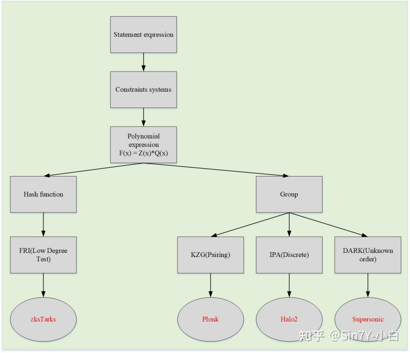
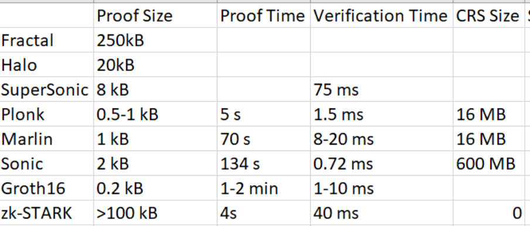

# zk方案对比

| 方案名称   | 证明大小（KB） | 证明时间（秒）          | 验证时间（秒）         | 是否需要可信设置       | CRS 大小                          |
|------------|----------------|-------------------------|------------------------|------------------------|-----------------------------------|
| Groth16    | 0.288          | 0.001 - 0.1             | 0.0001 - 0.001         | 是（特定电路）         | 与电路规模相关（典型约 10-100 MB）|
| Halo2      | 0.5 - 2        | 1 - 10                  | 0.01 - 0.1             | 否                     | 无                                |
| Nova       | 0.5 - 2        | 1 - 5（递归层数影响）   | 0.01 - 0.1             | 是（初始设置）         | 初始公共参数（约 10-100 MB）      |
| Supernova  | 0.5 - 2        | 0.5 - 3（优化后）       | 0.01 - 0.1             | 是（初始设置）         | 初始公共参数（约 10-100 MB）      |
| Bulletproofs | 1 - 2       | 0.1 - 1                 | 0.001 - 0.01           | 否                     | 无                                |
| PLONK      | 0.3 - 0.5      | 0.1 - 1                 | 0.001 - 0.01           | 可选（通用 SRS）       | 通用公共参数（约 10-100 MB）      |
| Plonky     | 0.5 - 1        | 0.5 - 2                 | 0.01 - 0.1             | 否                     | 无                                |
| GSNARK     | 0.5 - 1        | 0.5 - 2                 | 0.01 - 0.1             | 是（特定电路）         | 与电路规模相关（约 10-100 MB）    |
| Plonky2    | 0.5 - 1        | 0.17（MacBook Pro）     | 0.001 - 0.01           | 否                     | 无                                |
| Plonky3    | 0.5 - 1（推测）| 0.1 - 0.5（推测）       | 0.001 - 0.01（推测）   | 否（推测）             | 无（推测）                        |
| Marlin     | 0.5 - 1        | 1 - 5                   | 0.01 - 0.1             | 是（公共参考串）       | 与电路规模相关（约 10-100 MB）    |
| Sonic      | 0.5 - 1        | 1 - 5                   | 0.01 - 0.1             | 是（公共参考串）       | 与电路规模相关（约 10-100 MB）    |
| Supersonic | 0.5 - 1（推测）| 0.5 - 2（推测）         | 0.01 - 0.1（推测）     | 是（初始设置）         | 初始公共参数（约 10-100 MB）      |

