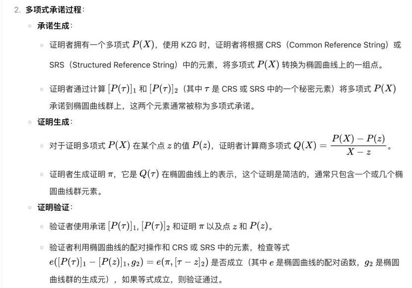

# pcs

PCS 的核心是生成一个承诺，证明者通过这个承诺让验证者相信存在某个多项式。常见的 PCS 有 KZG、BLS 等，基于椭圆曲线配对。

多项式承诺方案的六个核心步骤
1.初始化（Setup）：生成计算多项式承诺所需的必要参数。
2.提交（Commit）：计算多项式承诺，其结果为一个值。
3.公开（Open）：返回与多项式承诺对应的多项式函数。
4.验证多项式（VerifyPoly）：验证多项式承诺是否与多项式函数一致。
5.创建见证（CreateWitness）：证明多项式函数在某一点的值是否为证明方 P 声称的值。具体数学方法为：判断多项式是否能被整除，即：多项式(x)mod(x−a)=声称值
6.验证求值（VerifyEval）：验证方 V 利用双线性配对验证多项式函数在某一点的值是否为证明方 P 声称的值，具体数学方法为：通过双线性配对验证其数学乘法逻辑关系是否成立。
关键术语说明
双线性配对：一种密码学工具，用于将两个群的运算映射到第三个群，支持高效的非交互式验证。
见证：证明过程中生成的中间数据，用于支持验证者快速确认计算正确性。
多项式承诺：通过密码学方法承诺一个多项式，允许后续验证其特定属性而不泄露多项式本身

 
# piop
IOP 是通用的交互式证明协议，而 PIOP 专门针对多项式相关的验证。PIOP 则是通过多轮交互，验证者随机选择点，要求证明者提供多项式在这些点的值，从而验证多项式是否满足低度数或其他条件。
* PIOP核心功能：
    * 递归验证：将高次多项式分解为低次子多项式，逐轮挑战。
    * 低度数测试：通过 Reed-Solomon 码的纠错能力，确保多项式度数低于阈值。
* PIOP技术原理：
    * 随机挑战：验证者选择点 z，要求证明者提供 f(z) 和导数 f’(z)
    * 多线性扩展：将非多项式函数转换为多项式形式，便于验证。
    * 交互轮次：轮次与多项式度数的对数成正比，验证复杂度为 O(logd)
* PIOP典型协议：
    * SumCheck：验证多项式求和的正确性，递归固定变量并随机挑战。
* FRI：递归折叠多项式，结合 Merkle 树承诺，支持透明设置。

* pcs和piop的关系

| **Dimension**   | **PCS**                          | **PIOP**                          |
|------------------|----------------------------------|-----------------------------------|
| **Security**     | Relies on cryptographic assumptions (e.g., DLP) | Information-theoretic security (no assumptions) |
| **Interactivity**| Non-interactive (via Fiat-Shamir) | Interactive (multi-round challenges) |
| **Proof Size**   | Compact (e.g., KZG: 300 bytes)   | Larger (e.g., FRI: 10-100KB)      |
| **Verification Time** | Constant time (depends on pairing operations) | Linear in rounds (e.g., $O(\log d)$) |

* ip,pcp,iop,piop的概念区别

| **概念**                | **定义**                                                                 |
|-------------------------|-------------------------------------------------------------------------|
| **IP (Interactive Proof)**               | 证明者与验证者多轮交互，证明者向验证者证明陈述正确，验证者依据响应决定是否接受 |
| **PCP (Probabilistically Checkable Proof)** | 验证者随机抽取证明部分内容检查，以高概率判断证明正确性                     |
| **IOP (Interactive Oracle Proof)**        | 结合 IP 交互特性与 PCP 随机检验特性，验证者与预言机交互获取信息验证陈述     |
| **PIOP (Polynomial Interactive Oracle Proof)** | IOP 子类，用于验证多项式相关陈述，验证者随机挑战多项式点，证明者给出值以判断多项式性质 |