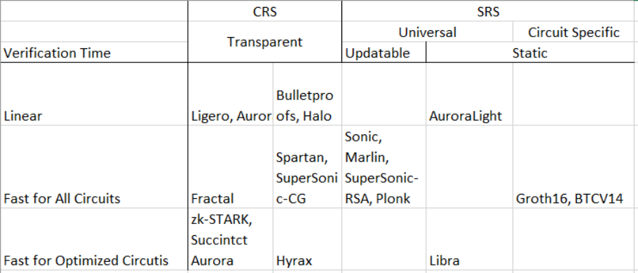

# CRS AND SRS

# CRS
在零知识证明 zk 中，CRS（Common Reference String，通用参考字符串）和 SRS（Secret Reference String，秘密参考字符串）是两个重要概念，以下是它们的解释：
CRS（通用参考字符串）
* 定义：CRS 是一个公开的字符串，在零知识证明系统中，它作为证明者和验证者之间的共同参考信息，用于执行证明和验证过程。可以将其理解为一种预先确定的、双方都知道的 “背景知识”，帮助双方在不泄露额外信息的情况下完成零知识证明的交互。
* 作用
    * 实现高效验证：它为证明者和验证者提供了一个统一的标准和基础数据，使得验证者能够快速验证证明者提交的证明的有效性，而无需重新计算所有的中间过程，大大提高了验证效率。
    * 确保一致性：在不同的证明和验证过程中，CRS 保证了所有参与方都遵循相同的规则和数据基础，确保了证明系统的一致性和可靠性，避免因不同的输入或计算方式导致的验证错误。
    * 支持通用性：许多零知识证明系统采用 CRS 来实现通用性，即可以用于多种不同类型的计算问题或证明场景。通过调整 CRS 的内容和结构，可以适应不同的应用需求，而无需为每个具体问题重新设计证明系统。
* 应用场景：在 zk-SNARKs 等零知识证明系统中广泛应用，如在区块链的隐私交易中，CRS 可用于验证交易的合法性和隐私性，确保交易双方在不泄露交易内容的情况下完成交易验证。

# SRS
Structure Reference String（SRS）是零知识证明（ZK）系统中的结构化公共参数，用于支持高效、可扩展的零知识证明生成与验证。与传统通用参考字符串（CRS）不同，SRS 通过多项式承诺和透明可信设置技术，实现证明系统的动态更新和跨场景适配。SRS 通常包含预计算的多项式承诺参数，允许证明者生成简洁的证明，并支持验证者在常数时间内完成验证。
* 核心特性
    * 多项式承诺方案
        * SRS 基于 **KZG10（Kate-Zaverucha-Goldberg）** 等多项式承诺方案，将复杂的计算转换为多项式形式，验证者通过挑战值快速验证多项式的正确性。
        * 数学基础：承诺方案支持单点 / 多点开放证明，证明尺寸与多项式次数无关。
    * 透明可信设置
        * 无需传统的可信初始化（Trusted Setup），通过多方安全计算（MPC）或渐进式安全生成 SRS，确保无单一可信方掌控完整密钥。
        * 案例：Halo2 的 SRS 生成支持将 SnarkJS 的 SRS 转换为 Halo2 格式，实现动态更新。
    * 动态扩展性
        * 支持增量式添加新约束，无需重新生成整个 SRS。例如，在智能合约升级时，只需更新部分参数即可适配新逻辑。
* 关键作用
    * 高效证明生成
        * SRS 包含预计算的椭圆曲线参数和多项式承诺值，证明者通过离线阶段生成电路索引（Index），显著加速证明生成。
        * 性能对比：Halo2 的证明生成速度比传统 zk-SNARKs 快 10 倍以上。
    * 常数时间验证
        * 验证者基于 SRS 和挑战值，通过单次椭圆曲线配对操作完成验证，时间复杂度与电路规模无关。
* 跨场景通用性
    * 一个 SRS 可支持任意 R1CS 电路（如隐私交易、链下计算、AI 模型验证），通过调整电路索引实现多场景适配。

| **特性**               | **Halo2 SRS**              | **Marlin SRS**             | **Circom（PLONK）**          |
|------------------------|---------------------------|---------------------------|-----------------------------|
| **通用性**             | 支持任意电路              | 支持有限规模电路          | 需为每个电路生成 SRS        |
| **证明速度**           | 快（Plonk 协议）          | 较快（AHP 技术）          | 较慢（通用电路）            |
| **验证时间**           | 常数时间                  | 线性时间                  | 线性时间                    |
| **可信设置**           | 透明（可选）              | 需可信初始化              | 需可信初始化                |
| **典型应用**           | Zcash、zkEVM              | 链下计算                  | 简单电路验证                |
*tips

Halo2 采用Kate-Zaverucha-Goldberg（KZG10）多项式承诺方案，该方案基于椭圆曲线配对（Pairing），支持高效的单点开放证明（Single-point Opening Proof）和多点开放证明（Multipoint Opening Proof）。其核心优势包括：
简洁性：证明尺寸与多项式次数无关，验证时间为常数。
通用性：一个 SRS 可支持任意电路，通过离线阶段生成特定电路的索引（Index）。
可更新性：支持动态添加新约束，无需重新生成整个 SRS。