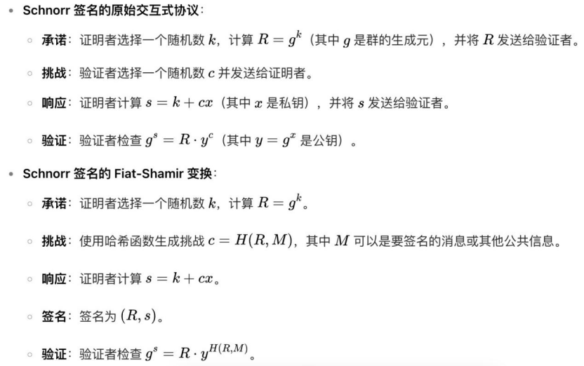

# fait_shamir和schnorr的联系和区别
* Schnorr 协议有三个步骤：承诺、挑战和响应。
    * 证明者生成一个随机数 r，计算 R = rG 并发送给验证者。
    * 验证者生成一个随机挑战 c，发送给证明者
    * 证明者计算 s = r + cx，发送给验证者
    * 验证者通过检查 sG 是否等于 R + cX 来验证。
这里的关键是验证者需要生成挑战 c，这需要双方实时交互，所以 Schnorr 协议是交互式的。

接下来是 Fiat-Shamir 变换。
* Fiat-Shamir 启发式将交互式协议转换为非交互式的。
    * 具体来说，就是用哈希函数代替验证者生成挑战 c。
    * 证明者将消息、承诺 R 和公钥等信息输入哈希函数，生成挑战 c。
    * 这样，证明者可以自己完成所有步骤，不需要验证者实时参与。
    * 因此，Fiat-Shamir 协议是非交互式的。
需要注意的是，哈希函数在这里扮演了随机预言机的角色，确保挑战的随机性
# fait_shamir
通过将交互过程中的挑战由验证者发送给证明者这一步替换为使用哈希函数来生成挑战，从而消除了交互的需要，将证明协议转换为非交互式。
* 承诺（Commitment）：证明者向验证者发送一个承诺，该承诺是对其秘密知识的一种模糊表示，不泄露秘密知识的具体内容，但足以让验证者进行后续的验证。
* 挑战（Challenge）：验证者生成一个随机挑战，并将其发送给证明者。
* 响应（Response）：证明者根据挑战和自己的秘密知识生成一个响应，发送给验证者。
* 验证（Verification）：验证者根据承诺、挑战和响应，使用验证算法检查证明者是否确实拥有相应的知识。
数独
1. 设定论断：如 “我知道某数独的解”。
2. 加密承诺：将解转换为加密形式（如哈希值）。
3. 随机挑战：验证者选择行、列或宫要求验证。
4. 局部验证：证明者提供对应区域的解密数据，验证者检查完整性。
5. 重复验证：通过多次挑战降低欺诈概率。

# schnorr
