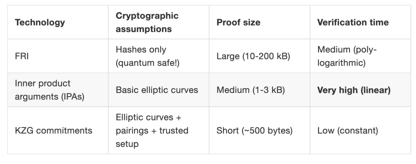

# the difference between kzg、fri and ipa

| PC Schemes | KZG10                                                                 | IPA                                      | FRI                              | DARKS                                      |
|------------|-----------------------------------------------------------------------|------------------------------------------|----------------------------------|--------------------------------------------|
| Low level tech | Pairing group                                                         | Discrete log group                       | Hash function                    | Unknow order group                         |
| Setup      | $G_1、G_2$ groups $g_1、g_2$ generators $e$ pairing function sk secret value in $F$ | $G$ elliptic curve $gn$ independent elements in $G$ | $H$ hash function $w$ unity root | $N$ unknow order $g$ random in $N$ $q$ large integer |
| Commitment | $(a_0s_0 + \dots + a_ns_n)g_1$                                      | $a_0g_0 + \dots + a_ng_n$             | $H(f(w_0), \dots, f(w_n))$     | $(a_0q_0 + \dots + a_dq_d)g$            |

| 特性          | FRI       | KZG   | IPA     | DARK(RSA) | DARK(Class) |
|---------------|-----------|-------|---------|-----------|-------------|
| **Transparent**    | yes       | no    | yes     | no        | yes         |
| **succinct**    | yes       | yes   | no      | yes       | yes         |
| **Post-quantum** | yes       | no    | no      | no        | no          |

* tips
    * Transparent: In the context of zero-knowledge proofs, it means no trusted setup is required. Trusted setup refers to the process in some zero-knowledge proof systems where a trusted third party is needed to generate common reference parameters during initialization. A system with transparency does not rely on such a trusted initialization process, avoiding potential security risks brought by trusting a third party.
    * Succinct: It indicates that the size (scale) of the proof is relatively small, and the time and resources required to verify the proof are also fewer. A zero-knowledge proof system with succinctness can complete proof verification in a shorter time and with lower computational resource consumption, improving the efficiency of the system.
    * Post-quantum: It means that the encryption technologies or algorithms adopted by the system or protocol can still maintain security in a quantum computer environment. With the development of quantum computing technology, traditional encryption algorithms based on certain mathematical problems (such as integer factorization, discrete logarithm problems) may be quickly cracked by quantum algorithms. A system with post-quantum property can resist such threats.
* FRI: It has transparency, requiring no trusted setup; possesses succinctness, with a small proof scale and efficient verification; has post-quantum property, ensuring security in a quantum computing environment.
* KZG: Does not have transparency, requiring a trusted setup; has succinctness, enabling efficient proof and verification; does not have post-quantum property, with its security possibly affected in a quantum computing environment.
* IPA: Has transparency, requiring no trusted setup; does not possess succinctness, with potential poor performance in proof scale or verification efficiency; does not have post-quantum property, being difficult to resist quantum computing attacks.
* DARK(RSA): Does not have transparency, requiring a trusted setup; has succinctness, enabling efficient proof and verification; does not have post-quantum property, as the RSA algorithm is vulnerable to quantum computing threats.
* DARK(Class): Does not have transparency, requiring a trusted setup; has succinctness, with relatively efficient proof and verification; does not have post-quantum property, lacking security guarantees when facing quantum computing.

| **特性**       | **FRI**          | **KZG** | **IPA**         | **DARK**        |
|----------------|------------------|---------|-----------------|-----------------|
| **Proof size** | $ O(\log_2 d) $ | $ O(1) $ | $ O(\log d) $ | $ O(\log d) $ |
| **Verify time** | $ O(\log_2 d) $ | $ O(1) $ | $ O(\log d) $ | $ O(d) $     |
| **Prove time** | $ O(d \cdot \log_2 d) $ | $ O(d) $ | $ O(d) $     | $ O(d) $     |
