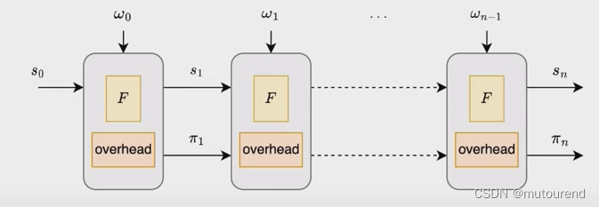
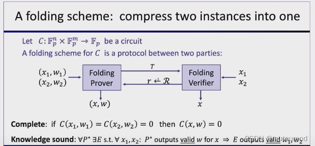

# nova
### Technical Principles
* Recursive Proofs: The core of Nova IVC is based on the concept of recursive proofs. It decomposes complex computational tasks into a series of smaller subtasks, each generating a proof. These sub-proofs are then recursively combined into a final proof to verify the correctness of the entire computation.
* Incremental Updates: When performing incremental computations, only the delta portion needs to generate a new proof, which is merged with previous proofs. By focusing solely on the incremental changes, verification workload is reduced.
* State Management: Requires efficient management of computational states, including recording intermediate results and their corresponding proofs. This enables rapid 定位 and updates to relevant state information during incremental computations.
* Proof Merging Algorithms: Specially designed algorithms merge proofs from different stages. These algorithms ensure that the merged proof can still accurately verify the entire computation process.
* Zero-Knowledge Properties: In certain scenarios, Nova IVC can provide zero-knowledge proof properties, meaning that verifiers gain no additional information about computational inputs or intermediate results during the verification of correctness

1. Function F: Input a certain state, execute function F, and output the updated state.
2. Overhead: Input a certain proof, run the overhead operation, and output the updated proof. The main task of the overhead is for the Verifier to verify the previous proof and generate a new proof for the correct execution of this verification process.
* To implement the IVC Prover $\mathcal{P}_F$ :

Some additional overhead is required to update the proof. These additional overheads are needed in each step of IVC. The key is how to minimize these additional overheads.
## folding (Proof Folding)
* Introduction
    * Proof Folding is a technology used to process and merge multiple zero-knowledge proofs. It can fold multiple proofs into a more concise one, thus reducing the storage and verification costs of proofs. In scenarios requiring handling a large number of proofs—such as transaction verification in blockchains, data consistency verification in distributed systems, etc.—proof folding technology has significant application value.
* Technical Principles
    * Utilization of Homomorphic Properties
        * Proof folding leverages the homomorphic properties of zero-knowledge proofs. Homomorphic properties mean certain mathematical operations can be performed on proofs without disclosing their contents.
        * For example, for two proofs P1 and P2, if they satisfy a specific homomorphic relationship, they can be folded into a new proof Pnew  via a particular algorithm. Pnew can then verify the correctness of the computational results represented by P1  and P2.
    * Linear Combination and Compression
        * Typically, multiple proofs are processed using linear combination. By selecting suitable coefficients, multiple proofs are combined linearly to form a new proof.
        * This new proof retains the information of the original proofs while achieving compression. For instance, in a distributed system with multiple nodes—each having its own proof—proof folding technology can compress these node proofs into a unified one for easier overall verification.
    * Recursive Folding
        * For folding multiple proofs, a recursive approach can be adopted. First, fold part of the proofs to get intermediate results, then continue folding these results with other proofs until a simplified final proof is obtained.
        * This recursive folding method efficiently handles large-scale proof sets, improving proof-processing efficiency.

