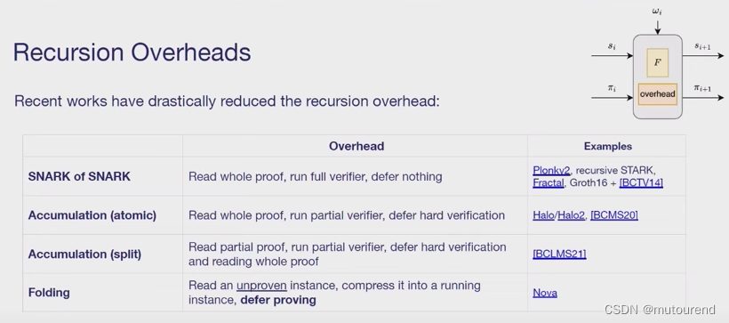
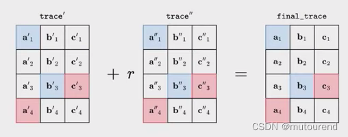

# Aggregate Proofs
In the zero - knowledge proof system, aggregate proof is a technology that combines multiple zero - knowledge proofs into a more concise one, thereby reducing storage and verification costs. It is crucial in scenarios involving a large number of proofs, such as blockchain transaction verification and data consistency verification in distributed systems. Its principles are mainly based on the following aspects:
* Utilization of Homomorphic Properties: Zero - knowledge proofs possess homomorphic properties, that is, specific mathematical operations can be carried out on the proofs without revealing their specific contents. Taking two zero - knowledge proofs $P_1$ and $P_2$​  as examples, if they satisfy a homomorphic relationship, they can be aggregated into a new proof $P_new$ through a specific algorithm, and $P_new$ can be used to verify the correctness of the computational results represented by $P_1$ and $P_2. For example, in some zero - knowledge proofs based on elliptic curve cryptography, the homomorphic properties of elliptic curves are used to perform aggregation operations on the proofs.
* Linear Combination and Compression: Linear combination is often used to handle multiple proofs. The specific approach is to select appropriate coefficients and perform a linear combination of multiple proofs to obtain a new proof. The new proof retains the key information of the original proofs while achieving proof compression. In a distributed system with multiple nodes, each node has its own proof. By aggregating these proofs through linear combination, the proofs of numerous nodes can be compressed into a unified proof, facilitating overall verification.
* Recursive Aggregation: For the aggregation of multiple proofs, a recursive approach can be adopted. First, some proofs are aggregated to obtain an intermediate result, and then the intermediate result is further aggregated with the remaining proofs. This process is repeated until a concise proof is finally obtained. This recursive approach can efficiently handle large - scale proof sets and improve the efficiency of proof processing.

### Introduction to Aggregate Proofs with Halo2 as an Example
* Based on Polynomial Commitment Scheme: The polynomial commitment scheme used by Halo2 is Inner product argument. It uses techniques such as discrete logarithms to perform relevant calculations of polynomial commitment for univariate polynomials. During the proof process, the aggregation of multiple proofs is achieved through operations on polynomial commitments. For example, borrowing the idea of recursive calls in binary search, evaluation proof is calculated in each round. This approach provides a fundamental cryptographic guarantee for aggregate proofs, enabling different proofs to be associated and integrated within the framework of polynomial commitments.
* Recursive Proof Composition: This is an important means for Halo2 to achieve aggregate proofs. It can effectively combine a large number of independently created proofs. Specifically, through a special construction, multiple proofs are gradually integrated, so that the verification time for a large number of proofs is comparable to that for verifying a single proof. For example, in a scenario with numerous sub - circuit proofs (similar to zkevm which contains various sub - circuit proofs such as evm circuits, ram circuits, and storage circuits), Halo2 can use the recursive proof composition technique to aggregate these sub - circuit proofs into a unified proof, facilitating overall verification in scenarios such as blockchains.
* Utilization of Homomorphic Properties: Halo2 uses the homomorphic properties of zero - knowledge proofs to handle proof aggregation. For multiple proofs that satisfy a certain homomorphic relationship, they are combined through a specific algorithm. During this process, the specific contents of the proofs are not revealed, and at the same time, it is ensured that the aggregated proof can verify the correctness of the computational results represented by the original multiple proofs.

Halo2 is a toolkit for constructing zero - knowledge proof systems, with unique implementation methods in aggregate proofs:
* No Trusted Setup Required: Halo2 does not rely on a trusted setup like some traditional zero - knowledge proof frameworks. The traditional trusted setup may have security risks (such as the risk of key leakage during the setup process). Halo2 circumvents this problem, ensuring the security and reliability of proofs at a fundamental level, and providing a more robust environment for the application of aggregate proofs.
* Component - based Design: It adopts a component - based design concept, where each module can be optimized independently to meet specific cryptographic requirements. This design makes Halo2 more flexible and efficient in handling aggregate proofs. Different zero - knowledge proof tasks can call appropriate components for processing according to their own characteristics, and then aggregate these processed proofs.
* Support for Recursive Proofs: Halo2 supports the feature of recursive proofs, which is of great significance for aggregate proofs. Recursive proofs can break down large computational tasks into multiple smaller stages and then integrate the proofs of each stage in a chained manner. In the context of aggregate proofs, this means that small - scale proof sets can be recursively aggregated first, gradually expanding the aggregation scale, and ultimately efficiently aggregating a large number of proofs into a concise one, greatly improving the verification efficiency. For example, in a complex cross - chain transaction scenario in blockchains, involving transaction proofs on multiple different chains, Halo2 can gradually aggregate these proofs through recursive proof methods, enabling verifiers to quickly verify the validity of all transactions without revealing sensitive transaction information.

# Recursive Proofs

### Comparison of ivc Schemes
1. SNARK of SNARK: The Verifier reads the entire proof and verifies the entire proof without any delay operations. [In each step, the complete proof needs to be read and verified.]
* Representative schemes of SNARK of SNARK include:
    * Plonky2: It is a recursive STARK. With $2^{12}$ gates, but they are wide gates — with a width of 135 (Goldilocks) elements, and the conjectured FRI soundness is about 100 bits.
    * Fractal: It is Groth16 + [BCTV14] (the 2013 paper "Succinct Non - Interactive Zero Knowledge for a von Neumann Architecture"). Fractal is very expensive, with about millions of R1CS constraints.
2. Accumulation (atomic): The Verifier reads the entire proof but only verifies part of it, postponing the verification of the hard part by accumulation. That is, after n recursive steps, only one verification of the hard part is required. [In each step, the complete step needs to be read and partially verified, and in the last step, only one verification of the hard part is required.]
* Representative schemes of Accumulation (atomic) include:
    * Halo/Halo2 and [BCMS20] (corresponding to the 2020 paper "Proof - Carrying Data from Accumulation Schemes"): The number of constraints is hundreds of thousands — better than the millions of constraints in SNARK of SNARK.
3. Accumulation (split): The Verifier reads part of the proof and only verifies part of it, postponing the verification of the hard part by accumulation. That is, after n recursive steps, only one reading of the complete proof and one verification of the hard part are required at the end. [In each step, only part of the proof needs to be read and partially verified, and only in the last step, one reading of the complete proof and one execution of the hard part verification are required.]
* Representative schemes of Accumulation (split) include:
    * [BCLMS21] corresponding to the 2020 paper "Proof - Carrying Data without Succinct Arguments": It sacrifices succinctness.
4. Folding: Reads the unproven instance, compresses it into a running instance, and postpones the proving. [In each step, the unproven instance is read, F is executed to obtain a new running instance, and the proof is only done in the last step.]
* Representative schemes of Folding include:
    * Nova: It is much cheaper in terms of overhead than previous schemes, with only about 20,000 constraints.

# folding
random linear combination

After introducing the random value r and performing random linear combination:
* Copy constraints still hold.
* The gate equation is non - linear, and there will be some problems.

# sangria
https://blog.csdn.net/mutourend/article/details/130897692?spm=1001.2014.3001.5502