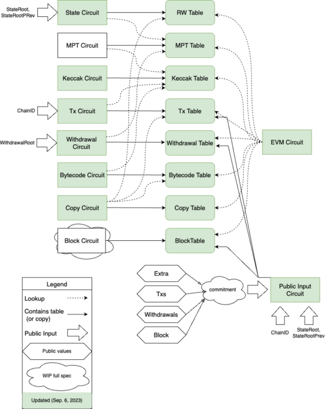
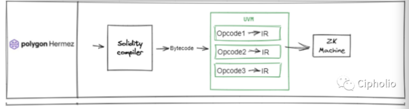

# evm
EVM is mainly composed of three parts: the chain context StateDB environment, the instruction interpreter Interpreter, and the Environment Function. As three independent components, each plays a distinct role in the virtual machine’s operation.
* Chain Context StateDB Environment
    * Provides on-chain data support for the EVM virtual machine and persistently stores data requiring storage during contract execution on the chain. For example, updates to account balances and internal states of contract accounts during contract execution—similar to a hard disk in a general-purpose computer.
* Instruction Interpreter Interpreter
    * Interprets and executes compiled contract bytecode. Unlike general virtual machines, EVM execution incorporates the "Gas" concept to address halting and resource consumption issues. Thus, when the interpreter executes instructions, it also calculates the Gas consumption for corresponding instructions. The interpreter invokes instructions based on the PC, fetches operands from the stack and memory. For simple instructions (e.g., arithmetic ADD, comparison GT), it directly computes results. For EVM semantic instructions (e.g., SSTORE, CALL), it interacts with StateDB or Environment Function using operands, calculates results, and stores them in the stack.
* Environment Function (ENV FUNC)
    * Provides execution logic for EVM-specific instructions, interacting with instruction operands and StateDB to compute results. (For instance, for the CALL instruction, EVM first retrieves operands from the stack, passes them and StateDB to ENV FUNC. ENV FUNC uses its execution logic and input data to calculate results, then returns them to the interpreter).
### EVM Characteristics
1. Limited support for elliptic curves.
2. 256-bit word size.
3. Numerous special opcodes.
4. Stack-based virtual machine.
5. High costs from Ethereum’s storage layout.
6. High costs from machine-based proofs.
### Solutions
1. Adoption of polynomial commitment.
2. Emergence of lookup table parameters and custom gadgets.
3. Increasing feasibility of recursive proofs.
4. Hardware acceleration improving proof efficiency.

# zkevm
Technical Analysis of Core Circuit Modules in ZKEVM
In the implementation of ZKEVM (Zero-Knowledge Ethereum Virtual Machine), a series of customized circuit modules form its core infrastructure. These circuits use cryptographic proof techniques to transform complex EVM execution processes into verifiable polynomial constraint systems. Below is a technical breakdown of the key circuit modules:
### Core State Management Circuits
1. State Circuit: Serves as the random-access memory for EVM state, divided into three sub-circuits:
2. Stack Sub-circuit: Manages dynamic stack operations via a stack pointer (SP), enforcing read/write constraints for PUSH/POP instructions to ensure stack state consistency before and after operations.
3. Memory Sub-circuit: Tracks MLOAD/MSTORE operations, orders memory accesses by a global counter (GC), and constructs a layout with operation addresses, values, and read/write flags to ensure temporal correctness of memory accesses.
4. Storage Sub-circuit: Manages persistent contract storage states, enabling efficient access verification through key-value storage and hash indexing.
5. EVM Circuit: Handles one by one execution of EVM bytecode, maintains the program counter (PC) and global counter (GC), and verifies whether each instruction’s operations on the stack, memory, and storage comply with protocol specifications. Supports over 99.5% of official EVM test vectors to ensure compatibility with the Ethereum ecosystem.
### Cryptographic Operation Circuits
1. Keccak256/Kaccak Circuit: Implements Ethereum’s standard hash algorithm for transaction signature verification, storage key generation, and other scenarios.
2. SHA256 Circuit: Provides additional hash function support for specific security requirements.
3. EC Precompiled Circuit: Optimizes elliptic curve cryptography operations, supporting ECDSA signature verification and key generation.
4. ModExp Circuit: Efficiently handles large-number modular exponentiation for complex mathematical computations in smart contracts.
### Data Structure and Protocol Circuits
1. RLP Circuit (FSM): Implements recursive length prefix encoding based on a finite state machine (FSM) to verify the serialization format of transaction data.
2. MPT Circuit: Maintains the Merkle Patricia Tree structure to ensure integrity verification of account states and storage data.
3. Poseidon Circuit: Adopts a new hash function to enable efficient zero-knowledge proof generation and enhance privacy protection.
### Transaction and Proof Generation Circuits
1. Tx Circuit: Verifies transaction validity, including signatures, gas limits, and data formats, ensuring compliance with consensus rules.
2. Root Circuit: Generates state root hashes to ensure verifiability of state transitions between blocks.
3. Proof Aggregation Circuit: Merges proofs generated by multiple sub-circuits into a final zero-knowledge proof, reducing on-chain verification costs.
### Auxiliary Optimization Circuits
1. Copy Circuit: Optimizes data replication operations to reduce redundant computations.
2. Bus-Mapping Module: Converts EVM execution traces into structured witness data for input to circuits.
3. Gadgets Abstract Layer: Encapsulates underlying circuit details and provides reusable verification components, such as range checks and hash validation.
* Integration and Functionality
    * These circuit modules achieve ZKEVM’s core capabilities through recursive composition and hierarchical verification:
    * EVM Bytecode Compatibility: Maintain compatibility with Ethereum’s execution environment while transforming computations into verifiable proofs.
* Proof Generation Workflow:
    * EVM execution traces are processed by the Bus-Mapping module.
    * The State Circuit verifies state consistency.
    * Cryptographic operations are validated via Gadgets.
    * The Proof Aggregation Circuit generates concise proofs.

This design ensures computational correctness while leveraging hardware acceleration and modular optimization to improve proof generation efficiency. As a result, ZKEVM supports high-throughput Layer 2 applications.

## comparison of some zkevm solution

