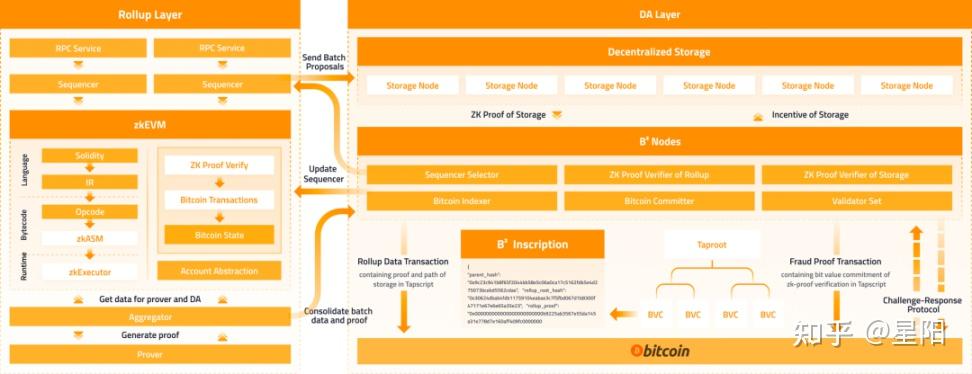

1. Fraud Proof Mechanism
* Characteristics of Fraud Proof Mechanism
    * On-Demand Verification: Fraud proof mechanisms do not require verifying all transactions upfront. Verification is only triggered when a transaction is challenged, and only the data related to the disputed transaction is audited.
* Game Theory Principle of Fraud Proof
    * Two Roles:
        * Committer: A node that guarantees the authenticity of Layer 2 transaction data.
        * Challenger: A participant who disputes the validity of transactions.
    * Precondition: Both parties must lock a certain amount of BTC in Bitcoin’s L1 UTXO as collateral, serving as a penalty for malicious behavior.
* Incentive and Punishment Mechanism
    * If Layer 2 Data Is Invalid:
        * If Bitcoin’s protocol confirms discrepancies between Layer 2 data and the previously committed L1 record (indicating tampering), the challenger wins.
        *The committer’s staked BTC is transferred to the challenger, and the transaction is rolled back.
    * If Layer 2 Data Is Valid:
        * If the data provided by the committer passes verification, the challenger loses.
        * The challenger’s staked BTC is awarded to the committer, and the transaction remains unchanged.

Key Features
* Efficiency: Reduces computational overhead by focusing verification on disputed transactions.
* Economic Security: Collateral ensures participants act in good faith, aligning incentives with protocol integrity.
* Decentralized Resolution: Leverages Bitcoin’s consensus to resolve disputes without central authority intervention.

Bitcoin Layer 2
* Off-chain: Refers to protocols and applications not developed on the Bitcoin Layer 1 chain.
* Connection with Layer 1: Has technical or economic ties with the Bitcoin Layer 1 chain.
* Enhancement: Boosts Bitcoin L1’s capabilities in aspects like performance, programmability, and privacy.

reference: [b2](https://www.bsquared.network/B2.pdf)
