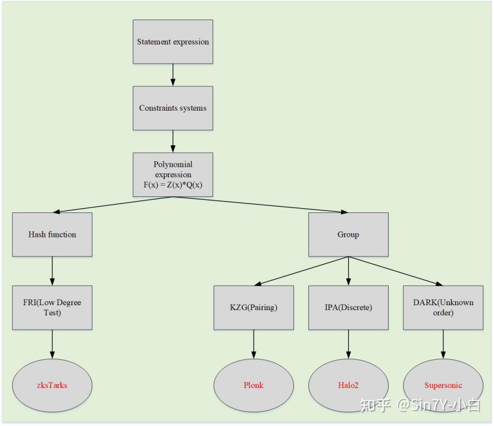
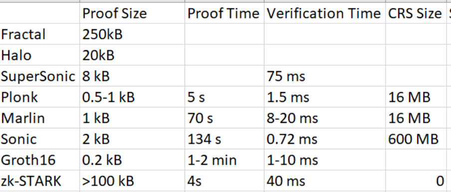

# zk_framwork_compairson

| **Scheme Name**   | **Proof Size (KB)** | **Proof Generation Time (seconds)**       | **Verification Time (seconds)**   | **Requires Trusted Setup?**       | **CRS Size**                          |
|-------------------|---------------------|-------------------------------------------|------------------------------------|-----------------------------------|---------------------------------------|
| Groth16           | 0.288               | 0.001 - 0.1                               | 0.0001 - 0.001                     | Yes (circuit-specific)            | Circuit-dependent (typically 10-100 MB)|
| Halo2             | 0.5 - 2             | 1 - 10                                    | 0.01 - 0.1                         | No                                | None                                  |
| Nova              | 0.5 - 2             | 1 - 5 (affected by recursion depth)       | 0.01 - 0.1                         | Yes (initial setup)               | Initial public parameters (10-100 MB) |
| Supernova         | 0.5 - 2             | 0.5 - 3 (optimized)                       | 0.01 - 0.1                         | Yes (initial setup)               | Initial public parameters (10-100 MB) |
| Bulletproofs      | 1 - 2               | 0.1 - 1                                   | 0.001 - 0.01                       | No                                | None                                  |
| PLONK             | 0.3 - 0.5           | 0.1 - 1                                   | 0.001 - 0.01                       | Optional (generic SRS)            | Generic public parameters (10-100 MB)|
| Plonky            | 0.5 - 1             | 0.5 - 2                                   | 0.01 - 0.1                         | No                                | None                                  |
| GSNARK            | 0.5 - 1             | 0.5 - 2                                   | 0.01 - 0.1                         | Yes (circuit-specific)            | Circuit-dependent (10-100 MB)         |
| Plonky2           | 0.5 - 1             | 0.17 (MacBook Pro)                        | 0.001 - 0.01                       | No                                | None                                  |
| Plonky3           | 0.5 - 1 (estimated) | 0.1 - 0.5 (estimated)                     | 0.001 - 0.01 (estimated)           | No (estimated)                    | None (estimated)                      |
| Marlin            | 0.5 - 1             | 1 - 5                                     | 0.01 - 0.1                         | Yes (common reference string)     | Circuit-dependent (10-100 MB)         |
| Sonic             | 0.5 - 1             | 1 - 5                                     | 0.01 - 0.1                         | Yes (common reference string)     | Circuit-dependent (10-100 MB)         |
| Supersonic        | 0.5 - 1 (estimated) | 0.5 - 2 (estimated)                       | 0.01 - 0.1 (estimated)             | Yes (initial setup)               | Initial public parameters (10-100 MB) |

