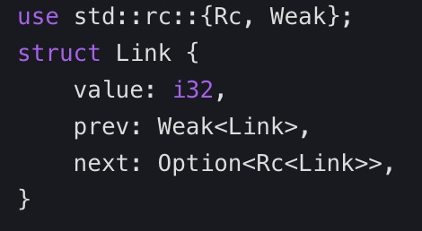
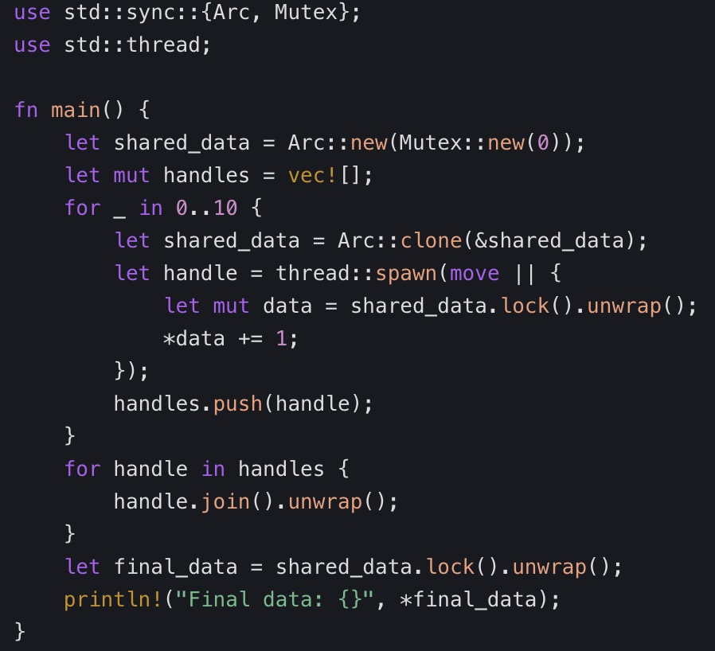

# rust interview
1. Ownership and Borrowing：Explain Rust's ownership system and its role in memory safety.
    * Rust’s ownership system ensures memory safety without a garbage collector. Key principles include:
        * Single Owner: Each value has exactly one owner.
        * Move Semantics: Transfer ownership when assigning or passing values.
        * Borrowing: Temporary access via references (&T).
        * Lifetimes: Ensure references outlive their referents.

fn main() {  
    let s = String::from("hello");  
    let s2 = s; // Ownership of `s` moves to `s2`  
    // println!("{}", s); // Error: `s` is no longer valid  
}  

2. What is a lifetime in Rust, and how does it prevent dangling pointers?
    * A lifetime ('a) is an annotation that defines the scope during which a reference is valid. The compiler enforces that references never outlive their data.

fn longest(s1: &str, s2: &str) -> &str {  
    if s1.len() > s2.len() {  
        s1  
    } else {  
        s2  
    }  
}  
// Error: Compiler can’t infer lifetimes for `s1` and `s2`  
Fix:

fn longest<'a>(s1: &'a str, s2: &'a str) -> &'a str {  
    // ...  

3. How do traits and generics work together in Rust?
    * Generics define placeholder types (T).
    * Traits specify shared behavior (e.g., Display, Clone).
    * Combine them to write generic code with trait bounds:

fn print<T: Display>(value: T) {  
    println!("{}", value);  
}  

4. Compare Result and Option in Rust.
    * Option<T>: Represents absence/presence of a value (Some/None).
    * Result<T, E>: Represents success (Ok) or failure (Err).
    * Use ? operator to propagate errors:

fn read_file() -> Result<String, io::Error> {  
    Ok(String::from("file content"))  
}  

5. How does Rust handle concurrency safely?
    * Threads: Lightweight threads managed by the OS.
    * Channels: Safe message passing via std::sync::mpsc.
    * Mutex: Synchronization primitive for shared data.

use std::sync::mpsc;  
let (tx, rx) = mpsc::channel();  
std::thread::spawn(move || {  
    tx.send("Hello from thread!").unwrap();  
});  
println!("{}", rx.recv().unwrap()); 

6. What are the differences between Box<T>, Rc<T>, and Arc<T>?
    * Box<T>: Single-owner heap allocation.
    * Rc<T>: Reference-counted pointer for shared ownership (single-threaded).
    * Arc<T>: Atomic reference-counted pointer (thread-safe).

let shared = Arc::new(42);  
let clone = Arc::clone(&shared);  

7. How do closures capture their environment in Rust?
    * Closures can capture variables from their scope:
    * Move closures: Take ownership (move || ...).
    * Immutable borrowing: Capture &T.
    * Mutable borrowing: Capture &mut T.
    
let x = 42;  
let closure = || println!("{}", x);  
closure();

8. Explain Rust’s iterator system and its benefits.
    * Iterators (Iterator trait) process sequences lazily.
    * Chain methods like map, filter, and fold for expressive code.

let numbers = vec![1, 2, 3, 4];  
let sum: i32 = numbers.iter().sum(); 

9. When should you use unsafe in Rust?
    * Dereferencing raw pointers (*const T, *mut T).
    * Calling unsafe functions or methods.
    * Accessing or modifying static variables.

unsafe {  
    let raw_ptr = Box::into_raw(Box::new(42));  
    let value = *raw_ptr; // Unsafe: Dereference raw pointer  
    println!("{}", value);  
}  

10.  What is the difference between declarative and procedural macros?
    * Declarative macros (macro_rules!): Pattern-matching expansion.
    * Procedural macros: Custom code generation via proc_macro.
macro_rules! greet {  
    ($name:expr) => {  
        println!("Hello, {}!", $name);  
    };  
}  
greet!("Alice"); // Output: Hello, Alice! 

11. How does Rust’s async/await work without threads?
    * Uses tokio runtime and futures for asynchronous I/O without blocking threads

12. Error Handling: What is the From trait’s role in error conversion?
    * Implement From to convert between error types (e.g., io::Error ↔ MyError).

13. Trait Objects: Explain dynamic dispatch with trait objects.
    * Trait objects (dyn Trait) allow runtime polymorphism:
        * let shape: Box<dyn Shape> = Box::new(Circle);

14. What is the difference between smart pointers and ordinary pointers?
    * Ordinary pointers simply point to a memory address, do not participate in Rust's ownership system, and lack the management of the lifecycle of the resources they point to. Smart pointers, on the other hand, are struct types. Based on implementing the Deref and Drop traits, they can automatically manage the lifecycle of the resources they point to. For example, Box<T> allows allocating data on the heap and manages the lifecycle of the data through ownership transfer; Rc<T> allows multiple pointers to point to the same data through the reference counting mechanism, and the data is only released when the reference count reaches 0; Arc<T> is used in a multithreaded environment to achieve thread-safe data sharing through atomic reference counting.

15. What are the usage scenarios of Box<T>?
    * When the stack space is insufficient: When the data volume is large and the stack space cannot meet the storage requirements, Box<T> can be used to allocate data on the heap to relieve the pressure on the stack space. For example, when dealing with recursive data structures, Box can prevent stack overflows. Take a binary tree as an example:
        * struct TreeNode {
            value: i32,
            left: Option<Box<TreeNode>>,
            right: Option<Box<TreeNode>>,
            }
    * Implement dynamic dispatch: Through Box<dyn Trait>, it is possible to determine at runtime which implementation of a method to call specifically, achieving dynamic polymorphism. Such as 

16. What are the differences and applicable scenarios between Rc<T> and Arc<T>?
    * Rc<T> manages the data on the heap through reference counting, allowing multiple Rc pointers to share the same data. When the reference count drops to 0, the data is automatically released. However, Rc is not thread-safe, so it is only applicable to single-threaded environments.
    * In contrast, Arc<T> uses atomic reference counting to ensure that the update operations of the reference count are thread-safe, so it is suitable for data sharing in a multithreaded environment. For example, in a multithreaded server application, if multiple threads need to read shared configuration data, Arc can be used to share the data.

17. What is the role of Weak<T>, and how does it work with Rc<T>?
    * Weak<T> is a weak reference to Rc<T>. It does not increase the reference count of the data it points to and is mainly used to solve the problem of circular references. At the same time, it avoids the accidental release of the data while holding a strong reference to it. The parent has a strong reference to the child, and the child has a weak reference to the parent, thus avoiding the memory leak caused by circular references.
    

18. How to use smart pointers to solve the problem of circular references?
    * The cycle can be broken by using Weak<T> at one end of the circular reference chain. Take a doubly linked list as an example, each node contains a weak reference to the previous node and a strong reference to the next node.
    
    * In the doubly linked list, the previous node uses a strong Rc reference to the next node, and the next node uses a weak Weak reference to the previous node. In this way, the linked list structure can be maintained, and the memory management problem caused by circular references can be avoided.

19. What are Mutex and RwLock, and what are their main functions?
    * Mutex is a mutual exclusion lock, which is a synchronization primitive used to ensure that at the same time, only one thread can access the data protected by it. In a multithreaded environment, this effectively prevents data races and ensures data consistency. For example, when multiple threads perform modification operations on a shared variable, Mutex can ensure that only one thread can modify the variable at the same time, avoiding data conflicts.
    * RwLock is a read-write lock, which distinguishes between read operations and write operations. Multiple threads are allowed to perform read operations simultaneously because read operations do not modify the data and will not cause data races; but only one thread is allowed to perform write operations, and when a write operation is in progress, no other threads are allowed to perform read or write operations. This makes RwLock significantly improve the concurrency performance in scenarios where read operations are much more frequent than write operations.

20. What are the differences in the usage of Mutex and RwLock?
    * When using Mutex, after a thread acquires the lock, it has exclusive access to the protected data, and other threads must wait until the lock is released to acquire it. mutex.lock().unwrap();
    * When using RwLock, read operations and write operations acquire the lock through different methods. The read operation uses the read method, allowing multiple threads to read simultaneously; the write operation uses the write method, and only one thread is allowed to perform the write operation at the same time. rwlock.write().unwrap();

21. In which scenarios should Mutex be preferred, and in which scenarios should RwLock be preferred?
    * When the operations of multiple threads on the shared data are mainly write operations, or the frequencies of read and write operations are similar, Mutex should be preferred. Because RwLock also requires exclusive access during write operations, and its internal implementation is relatively complex, which will bring additional overhead. For example, in a multithreaded logging system, if multiple threads frequently write logs, using Mutex can more simply and effectively ensure data consistency.
    * When read operations are much more frequent than write operations, RwLock should be preferred. Take the database cache as an example, multiple threads may frequently read the cache data, but only perform write operations when the data is updated. At this time, RwLock allows multiple threads to read simultaneously, which can greatly improve the concurrency performance of the system.

22. How to avoid the deadlock problem during the use of Mutex and RwLock?
    * Acquire locks in a fixed order: When multiple threads need to acquire multiple locks, all threads acquire the locks in the same order to prevent the formation of a lock dependency loop. For example, if both thread A and thread B need to acquire Mutex1 and Mutex2, then both threads first acquire Mutex1 and then acquire Mutex2, which can avoid deadlocks.
    * Use the try_lock method: The try_lock method attempts to acquire the lock. If the lock is not available, it immediately returns Err without blocking the thread. The thread can decide subsequent operations according to the return result, such as trying to acquire the lock again after waiting for a period of time, or performing other tasks.

23. What are MutexGuard, RwLockReadGuard, and RwLockWriteGuard, and what are their functions?
    * MutexGuard is the type returned after Mutex acquires the lock. It implements the Drop trait. When the MutexGuard goes out of scope, it will automatically release the lock. This ensures the correct management of the lock and avoids the lock not being released due to code exceptions or logical errors.
    * RwLockReadGuard and RwLockWriteGuard are the types returned when RwLock performs read operations and write operations respectively, and they also implement the Drop trait. When they go out of scope, they will automatically release the corresponding read lock or write lock, ensuring the correct use and management of the read-write lock.

24. Please briefly describe the implementation method of multithreading in Rust, as well as the main functions of the std::thread module.
    * Multithreading in Rust is mainly implemented through the std::thread module. The thread::spawn function can be used to create a new thread. This function takes a closure as a parameter, and the code in the closure will be executed in the new thread. thread::current is used to obtain the handle of the current thread, and thread::sleep is used to make the current thread sleep for a specified time, etc.

25. What is thread safety? How to ensure data thread safety in Rust?
    * Thread safety means that when multiple threads access a certain shared resource (such as a data structure or a function) at the same time, there will be no data races, inconsistencies, or other undefined behaviors, and the correctness and stability of the program can be ensured.
    * In Rust, the main ways to ensure data thread safety are as follows:
        * Use synchronization primitives such as Mutex and RwLock. They can control the access to shared data to ensure that only one thread can modify the data at the same time and avoid data races.
        * Utilize Rust's ownership and borrowing rules. In a multithreaded environment, ensure that each piece of data is owned by only one thread, or follow the rules of immutable borrowing (readable by multiple threads) and mutable borrowing (writable by a single thread) when sharing data to prevent the data from being modified by multiple threads simultaneously.
        * Use a combination of Arc (Atomic Reference Counting) and Mutex or RwLock. Arc can share the ownership of data among multiple threads, and with the cooperation of synchronization primitives, it can ensure the safe access to shared data.

26. Please explain the role of Arc<Mutex<T>> and give an example of how to use it.
    * Arc<Mutex<T>> is used to safely share mutable data in a multithreaded environment. Arc (Atomic Reference Counting) is an atomic reference counting type that allows sharing the ownership of data among multiple threads. And Mutex is used to provide mutual exclusion access to ensure that only one thread can access the data wrapped by Mutex at the same time.
    * Multiple threads share a mutable integer through Arc<Mutex<T>> and perform increment operations on it. Mutex ensures the thread safety of the data.
    

27. Please describe the role of JoinHandle and explain how to use it to wait for a thread to complete execution.
    * JoinHandle is the type returned by the std::thread::spawn function. Its role is to manage and wait for the execution completion of a thread. Each JoinHandle corresponds to a created thread. By calling the join method of the JoinHandle, the current thread can be blocked until the corresponding child thread finishes execution, and then the execution result of the child thread can be obtained.

28. How to solve the problems of errors reported by the     borrow checker, such as dangling references and data races?
    * Dangling references: A dangling reference refers to a situation where the memory pointed to by the reference has already been freed. To solve this problem, ensure that the lifetime of the reference is long enough so that the data it points to will not be freed before the reference is used. For example, avoid returning a reference to a local variable from a function.
    * Data races: A data race occurs when multiple threads or multiple references within the same thread access and modify the same data simultaneously. Using the borrowing rules can prevent data races, ensuring that there is only one mutable reference or multiple immutable references at the same time. In addition, in a multithreaded environment, synchronization primitives such as Mutex can be used to ensure the security of data access.

29. Explain the roles of the async and await syntax, and illustrate the scheduling and execution principles of asynchronous tasks. Write a simple asynchronous function to simulate a network request and wait for its completion in the main function.
    * The roles of the async and await syntax:
        * The async keyword is used to define an asynchronous function, and this function returns a type that implements the Future trait. An asynchronous function allows the use of the await expression within its body, enabling the function to pause its execution and return control to the caller without blocking the thread. This allows the program to continue executing other tasks while waiting for some time-consuming operations (such as network requests, file reading and writing, etc.) to complete, improving the concurrency performance and responsiveness of the program.
        * The await expression is used to pause the execution of an asynchronous function until the Future it is waiting for is completed. When await is encountered, the asynchronous function will pause its execution and return control to the caller. After the Future is completed, the asynchronous function will continue to execute from the paused point and obtain the result of the Future.
    * The scheduling and execution principles of asynchronous tasks:
        * In Rust, the scheduling of asynchronous tasks usually depends on a runtime (such as tokio). The runtime is responsible for managing the thread pool, scheduling the execution of asynchronous tasks, and handling the dependencies between tasks.
        * When an asynchronous function is called, it returns a Future. This Future does not execute immediately but is scheduled by the runtime at an appropriate time. The runtime will put the Future into a task queue. When the preconditions of the task are met (for example, the Future awaited by await is completed), the runtime will take the task out of the task queue and execute it.
        * The role of the await expression is to pause the execution of the current asynchronous function and return the control of the Future to the runtime. The runtime will continue to schedule other executable tasks. When the Future awaited by await is completed, the runtime will return the control back to the paused asynchronous function, allowing it to continue execution.

The 'static lifetime indicates that the lifetime of the reference extends from the start to the end of the program

30. Characteristics and Usage Scenarios of Declarative Macros (macro_rules!) and Procedural Macros (including Custom derive Macros, Attribute Macros, and Function-like Macros)
    * Declarative Macros (macro_rules!)
    * Characteristics:
        * Based on Pattern Matching: Match the input code snippets by defining a series of patterns, and generate corresponding code according to the matching results.
        * Compile-time Expansion: During the compilation stage, the compiler will expand the macro call into actual code, which does not affect the runtime performance.
        * Limited Code Generation Ability: Code generation can only be carried out according to the pre-defined patterns, and it has limited support for complex and dynamic code generation requirements.
    * Usage Scenarios:
        * Code Simplification and Reuse: Used to eliminate repetitive code structures. For example, define a group of similar functions or expressions. Take the logging macro log!(...) as an example, which can conveniently record log information at different levels.
        * Conditional Compilation Code Generation: Generate different code snippets according to different compilation configurations or platforms, such as the macro definitions related to conditional compilation like #[cfg(target_os = "linux")].
        * Simple Data Structure Initialization: Can be used to simplify the initialization process of data structures. For example, define a macro to quickly initialize an array of structures in a specific format.
    * Procedural Macros
    * Characteristics:
        * More Powerful Code Generation Ability: Other Rust code can be dynamically generated through Rust code during the compilation period, and it can handle more complex code generation logic.
        * Close Interaction with the Compiler: It can access and operate the internal data structures of the compiler, such as the syntax tree, so as to achieve in-depth analysis and modification of the code.
        * Require Separate Crate Implementation: Procedural macros usually need to be implemented in a separate crate and then introduced and used in the main project.
    * Usage Scenarios:
        * Custom derive Macros: Used to automatically derive and implement specific traits for structures or enums. For example, a custom derive(MyTrait) macro can be defined to let the compiler automatically generate the implementation code of MyTrait for the specified type, reducing the workload of manually writing repetitive trait implementations.
        * Attribute Macros: Can be used to add custom attributes to code elements and perform specific code generation or modification operations during the compilation period according to these attributes. For example, attribute macros used to mark API routes, or custom attribute macros used for code analysis and optimization.
        * Function-like Macros: Can achieve functions similar to functions, but can perform more flexible processing and transformation on the input code during the compilation period. For example, a function-like macro can be implemented to generate different type conversion codes according to different input types.