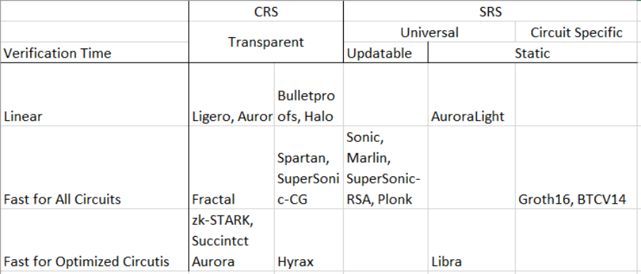

# CRS AND SRS

# CRS (Common Reference String)
In zero-knowledge proof (ZK), CRS (Common Reference String) and SRS (Secret Reference String) are two important concepts. Below is their explanation:

* Definition: CRS is a public string. In a zero-knowledge proof system, it serves as shared reference information between the prover and the verifier, used to execute the proof and verification process. It can be understood as pre-determined "background knowledge" known to both parties, helping them complete the ZK proof interaction without disclosing extra information.
* Functions:
    * Efficient Verification: It provides a unified standard and basic data for the prover and verifier, allowing the verifier to quickly validate the proof’s validity without recalculating intermediate processes, thus greatly improving verification efficiency.
    * Consistency Assurance: Across different proof processes, CRS ensures all participants follow the same rules and data foundation, guaranteeing the proof system’s consistency and reliability, and avoiding verification errors from inconsistent inputs or calculations.
    * Universality Support: Many ZK proof systems use CRS for universality, applying to various computational problems or scenarios. By adjusting CRS content/structure, it adapts to different needs without redesigning the proof system for each problem.
* Application Scenarios: Widely used in systems like zk-SNARKs. For example, in blockchain privacy transactions, CRS verifies transaction legality and privacy, enabling verification without disclosing transaction details.

# SRS
Structure Reference String (SRS)
Structure Reference String (SRS) is a set of structured public parameters in zero-knowledge (ZK) proof systems, designed to enable efficient and scalable proof generation and verification. Unlike traditional Common Reference Strings (CRS), SRS achieves dynamic updates and cross-scenario adaptability through polynomial commitment and transparent trust setup technologies. SRS typically includes precomputed polynomial commitment parameters, allowing provers to generate concise proofs and verifiers to complete verification in constant time.
* Core Features
    * Polynomial Commitment Scheme
        * SRS relies on polynomial commitment schemes like KZG10 (Kate-Zaverucha-Goldberg), transforming complex computations into polynomial forms. Verifiers validate polynomial correctness quickly using challenge values.
        * Mathematical Foundation: The scheme supports single-point/multipoint opening proofs, with proof size independent of polynomial degree.
    * Transparent Trust Setup
        * Eliminates the need for traditional Trusted Setup. SRS is generated via Multi-Party Computation (MPC) or progressive security, ensuring no single party controls the full secret key.
        * Example: Halo2’s SRS generation supports converting SnarkJS-formatted SRS into Halo2 format for dynamic updates.
    * Dynamic Scalability
        * Enables incremental addition of new constraints without regenerating the entire SRS. For example, smart contract upgrades only require partial parameter updates to adapt to new logic.
* Key Roles
    * Efficient Proof Generation
        * SRS contains precomputed elliptic curve parameters and polynomial commitment values. Provers generate circuit indices offline, significantly accelerating proof creation.
        * Performance Comparison: Halo2’s proof generation is over 10 times faster than traditional zk-SNARKs.
    * Constant-Time Verification
        * Verifiers complete verification via a single elliptic curve pairing operation based on SRS and challenge values, with time complexity independent of circuit size.
    * Cross-Scenario Universality
        * A single SRS supports arbitrary R1CS circuits (e.g., privacy transactions, off-chain computation, AI model validation) through circuit index adjustments.

| **Feature**          | **Halo2 SRS**                | **Marlin SRS**               | **Circom (PLONK)**           |
|-----------------------|------------------------------|------------------------------|------------------------------|
| **Universality**      | Supports any circuit         | Supports limited-scale circuits | Requires circuit-specific SRS |
| **Proof Speed**       | Fast (Plonk protocol)       | Moderate (AHP technique)     | Slow (general circuits)      |
| **Verification Time** | Constant time                | Linear time                  | Linear time                  |
| **Trusted Setup**     | Transparent (optional)       | Requires trusted initialization | Requires trusted initialization |
| **Typical Use Cases** | Zcash, zkEVM                | Off-chain computation        | Simple circuit verification  |

### tips
* Halo2's Kate-Zaverucha-Goldberg (KZG10) Polynomial Commitment Scheme. Halo2 employs the Kate-Zaverucha-Goldberg (KZG10) polynomial commitment scheme, which is based on elliptic curve pairing. This scheme supports efficient Single-point Opening Proof and Multipoint Opening Proof. Its core advantages include:
    1. Simplicity: Proof size is independent of polynomial degree, and verification time is constant.
    2. Universality: A single SRS can support arbitrary circuits through offline generation of circuit-specific indices.
    3. Updatability: Dynamically adds new constraints without regenerating the entire SRS.
* Mathematical Foundation:
    * Polynomial commitment: Represented as Gf (where G is an elliptic curve generator).
    * Verification: Uses challenge values (e.g., α) to validate f(α) without accessing polynomial coefficients.
