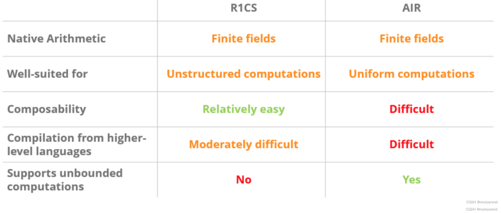

# r1cs、plonkish、air

* plonkish and air
| **Dimension**          | **PLONKish**                                      | **AIR**                                               |
|------------------------|---------------------------------------------------|-------------------------------------------------------|
| **Protocol Type**      | ZK-SNARKs (based on elliptic curves)              | ZK-STARKs (based on hash functions)                   |
| **Trusted Setup**      | Optional (general SRS)                            | None (transparent setup)                              |
| **Arithmetization Method** | Permutation polynomial + linear constraints  | Matrix structuring (rows represent steps, columns represent variables) |
| **Proof Characteristics** | Succinctness (small proof, fast verification) | Scalability (supports recursion, linear complexity)   |
| **Security**           | Relies on elliptic curve assumptions (may be affected by quantum attacks) | Quantum resistance (based on hash functions) |
| **Typical Applications** | Aztec, zkEVM, PLONK protocol                      | StarkNet, StarkEx, ZK-STARKs                          |

PLONKish is the arithmetization method of the PLONK (Permutations over Lagrange-bases for Oecumenical Noninteractive Knowledge arguments) protocol. Its core is to decompose computations into a combination of permutation polynomials and linear constraints.
* Permutation Table Optimization: Through precomputed permutation tables (such as Merkle trees), complex operations are transformed into table lookup operations, reducing the number of constraints.
* Universal SRS (Common Reference String): A trusted setup generates universal parameters once, supporting multiplexing of multiple circuits and avoiding generating parameters separately for each circuit.
* Recursion-Friendly: Supports dynamic adjustment of the circuit structure, suitable for recursive proofs (such as nested verification).
* AIR is the arithmetization method of the ZK-STARKs (Zero-Knowledge Scalable Transparent Arguments of Knowledge) protocol. It encodes the computation process into polynomial constraints through matrix representation.
    * Matrix Structuring: Represents computation steps as rows of a matrix and variables as columns, verifying global consistency through polynomial interpolation and evaluation.
    * Transparent Setup: No trusted parameters are required. It relies on the collision resistance of hash functions, avoiding initialization trust risks.
* Recursive Extension: Supports infinite recursive proofs, suitable for handling large-scale computations (such as StarkNet's general ZK Rollup).
