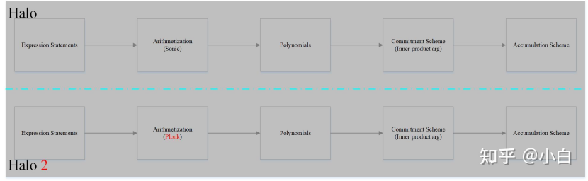

# halo2
Halo2的证明系统可以分解成五个部分：
1. 对电路中的主要模块多项式承诺：
    * 单元格的赋值
    * 查找表证明中的置换和乘积
    * 相等约束的置换
2. 电路中和零相关的部分，构造消退证明：
    * 标准的和自定义门
    * 查找表规则
    * 相等约束规则
3. 在所有需要的点上，获取上述多项式的取值：
    * 所有自定义门上的偏移信息
    * 消退证明的各个部分
4. 构建多点打开证明，检查所有的多项式取值和相应的承诺是否一致
    * 采用内积证明为多点打开证明生成证明

## halo和halo2

# halo2
以下是对 Halo 2 的技术原理、步骤、优缺点的详细解释：
技术原理
* 基于 PLONK 的算术化：
    * Halo 2 是基于 PLONK（Permutations over Lagrange-bases for Oecumenical Noninteractive arguments of Knowledge）构建的零知识证明系统。它使用了 PLONK 的算术化思想，将计算问题表示为多项式约束，这些多项式约束在有限域上定义。
    * 利用多项式承诺和多项式的性质，使得证明者可以对多项式的计算结果进行承诺，并提供证明，验证者可以在不了解计算的具体细节的情况下验证多项式的计算是否正确。
* 定制化的门和查找表：
    * Halo 2 提供了高度灵活的定制化门（Custom Gates）和查找表（Lookup Tables）。
    * 定制化门允许开发者定义自己的门逻辑，以满足不同的计算需求。例如，开发者可以根据自己的计算任务，设计专门的加法门、乘法门、比较门等，增加了系统的灵活性和适应性。
    * 查找表用于存储预先计算的数据，使得证明者可以在证明过程中引用这些数据，而无需将它们作为多项式的一部分，减少了多项式的复杂度和计算量。
* 递归证明和实例化：
    * 支持递归证明，允许将一个证明嵌入到另一个证明中，以构建复杂的证明链。这在需要证明多个计算步骤或多次迭代计算的情况下非常有用。
    * 通过递归，可以将证明的大小和验证时间进行压缩，使得证明可以在有限的空间和时间内进行验证，实现可扩展性。
步骤

1. 算术电路的构建：
    * 将计算转换为算术电路：首先，将需要证明的计算任务表示为算术电路，将输入、中间计算结果和输出通过门和导线连接起来。例如，对于一个简单的计算任务 ，将其表示为一系列的门（乘法门、加法门等）和导线（代表变量）。
    * 定义定制门和查找表（可选）：根据需要，使用 Halo 2 的定制门和查找表功能，优化电路。如果有一些数据可以存储在查找表中，如预定义的常量表或一些映射关系，可以将其存储在查找表中。
2. 多项式约束的生成：
    * 将算术电路转换为多项式约束，使用 PLONK 算术化技术。每个门和导线都被表示为多项式约束，将电路中的计算转换为多项式之间的等式关系。
3. 证明生成：
    * 证明者使用多项式承诺方案对多项式进行承诺，将多项式映射到椭圆曲线上的点。
    * 根据计算结果和承诺，生成证明所需的信息，包括证明多项式的计算和承诺，以及使用查找表和定制门的相关信息。
4. 证明验证：
    * 验证者使用证明者提供的证明信息，根据多项式约束和承诺，通过椭圆曲线密码学的操作（如配对运算）和其他验证算法，检查证明的正确性。
    * 对于递归证明，验证者会递归地验证子证明的正确性，最终验证整个证明链。
优缺点
优点

* 灵活性和可定制性：
    * 提供定制门和查找表，使得开发者可以根据具体的计算任务灵活设计电路，满足各种复杂的计算需求，而不受限于标准的门类型。
* 递归证明能力：
    * 支持递归证明，可用于构建复杂的证明链，在需要对多个计算步骤或多次迭代进行证明时，可以有效地压缩证明的大小和验证时间，提高系统的可扩展性。
* 性能和效率：
    * 在处理复杂计算时，通过灵活的算术化和查找表等功能，可以优化证明的生成和验证，减少证明的大小和验证时间，提高整体性能。
* 广泛适用性：
    * 适用于多种密码学应用，包括但不限于隐私保护、区块链中的隐私交易、身份验证等，可用于构建零知识证明协议，保护用户的隐私和安全。
缺点

* 学习曲线较陡：
    * 由于涉及到复杂的多项式、椭圆曲线密码学和零知识证明的高级概念，对于开发人员来说，学习和掌握 Halo 2 的使用和开发具有一定的难度，需要深入理解其内部的算术化、多项式约束等概念。
* 依赖可信设置（在某些版本中）：
    * 在一些早期版本或某些实现中，可能需要可信设置（如 CRS 或 SRS 的生成），这可能会引入安全风险。不过，在一些实现中，可以使用多方计算来降低可信设置的风险，但仍然需要额外的计算和协调。
* 复杂性：
    * 由于其强大的功能和灵活性，系统本身的实现和使用可能会比较复杂，对于系统的开发、调试和维护都需要较高的技术水平，可能会出现更多的潜在错误和安全隐患，需要更仔细的设计和实现。

# halo2的几个证明系统

Halo 2 是一种强大的零知识证明系统，通过其基于 PLONK 的算术化、定制门和查找表以及递归证明等特性，提供了一种灵活、高效的方式来构建和验证零知识证明。
1. 查找证明（Lookup Argument）
* 技术原理：
    * 查找证明用于验证某个元素是否存在于预定义的集合中，同时隐藏集合内容。
    * Halo2 通过将集合编码为多项式，并利用多项式承诺方案（如 FRI）来证明元素的存在性。具体步骤如下：
        1. 多项式编码：将集合中的元素映射为多项式的系数，例如将集合{a, b, c}编码为多项式f(x) = a + b x + c x²。
        2. 承诺生成：证明者对多项式f(x)生成承诺，并发送给验证者。
        3. 挑战验证：验证者随机选择一个点x，要求证明者提供f(x)的值。若该值与集合中某个元素一致，则证明有效。
2. 置换证明（Permutation Argument）
* 技术原理：
    * 置换证明用于验证两个列表是否为彼此的置换，即元素相同但顺序不同。
    * Halo2 通过多项式承诺和置换索引多项式实现：
        1. 多项式承诺：将两个列表编码为多项式f(x)和g(x)，并生成承诺。
        2. 置换索引：构造置换索引多项式σ(x)，表示元素在两个列表中的对应关系。
        3. 验证约束：验证者检查f(x) = g(σ(x))是否成立，确保元素一一对应。
* 实现优化：
    * 递归置换：支持对嵌套列表的置换验证，例如在智能合约中验证交易顺序的正确性。
    * 随机挑战：通过引入随机数β和γ，降低伪造证明的概率（基于 Schwartz-Zippel 定理）。
* 应用场景：
    * 区块链交易排序验证。
    * 数据完整性验证（如分布式存储中的文件分片重组）。
3. 消退证明（Fade Argument）
* 技术原理：
    * 消退证明用于验证某个值随时间或步骤的推移逐渐减少或变化，例如分期支付或递减供应。Halo2 通过 ** 消失多项式（Vanishing Polynomial）
    * 实现：
        1. 多项式构造：将消退过程编码为多项式h(x)，其中x表示时间或步骤。
        2. 消失约束：构造消失多项式Z(x)，其根对应消退过程的结束条件（如Z(x) = x - T，其中T为截止时间）。
        3. 验证条件：证明者需证明h(x) = 0在Z(x)的根处成立，即h(T) = 0。
    * 实现优化：
        * 递归消失：支持对多个消退过程的嵌套验证，例如在多阶段智能合约中验证每个阶段的支付是否合规。
        * 时间戳绑定：通过将多项式与时间戳关联，确保消退过程不可篡改。
* 应用场景: 
    * 分期付款合约验证。
    * 动态供应模型（如通证的线性释放）。
4. 内积证明（Inner Product Argument）
* 技术原理：
    * 内积证明用于验证两个向量的内积等于某个值，而不暴露向量的具体内容。
    * Halo2 基于内积承诺(Inner Product Commitment)实现：
        1. 向量编码：将向量a = [a₁, a₂, ..., aₙ]和b = [b₁, b₂, ..., bₙ]编码为多项式$A(x) = a₁ + a₂x + ... + aₙ x^{n-1}$和$B(x) = b₁ + b₂ x + ... + bₙ x^{n-1}$。
        2. 内积计算：计算内积c = a₁b₁ + a₂b₂ + ... + aₙbₙ，并构造多项式C(x) = c。
        3. 承诺验证：验证者检查$A(x) · B(x) ≡ C(x) mod (x^n - 1)$是否成立，其中·表示多项式乘法。
* 实现优化：
    * 快速数论变换（NTT）：利用 NTT 加速多项式乘法，将时间复杂度从O(n²)降至O(n log n)。
    * 递归内积：支持对多个向量的内积验证，例如在机器学习模型推断中验证输入与权重的内积。
* 应用场景：
    * 隐私保护的机器学习模型推断。
    * 安全多方计算中的数据聚合。
5. 多点打开证明（Multi-point Opening Argument）
* 技术原理：
    * 多点打开证明允许同时验证多项式在多个点上的值，提升批量验证效率。
    * Halo2 通过快速傅里叶变换（FFT）和多项式分组实现：
        1. 多项式分解：将多项式f(x)分解为多个子多项式f₁(x), f₂(x), ..., fₖ(x)，每个子多项式对应不同的点集。
        2. 多点评估：对每个子多项式在其对应的点集上进行评估，生成评估值列表。
        3. 承诺验证：验证者检查所有评估值是否与多项式承诺一致，确保多项式在所有点上的正确性。
* 实现优化：
    * 并行计算：利用多核处理器并行处理多个点集的评估，减少证明生成时间。
    * 压缩编码：将评估值压缩为哈希值，降低证明大小（如从O(n)降至O(log n)）