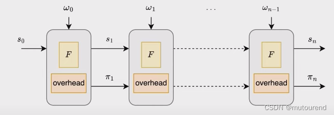
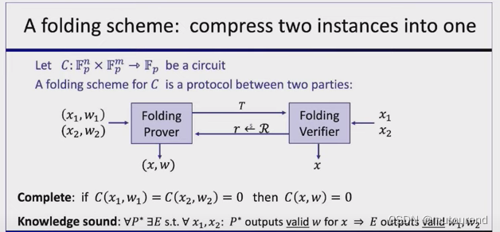

# nova
### 技术原理
* 递归证明：Nova IVC 核心基于递归证明的思想。它将一个复杂的计算任务分解为一系列较小的子任务，每个子任务都生成一个证明。然后，通过递归的方式将这些子证明组合成一个最终的证明，以验证整个计算的正确性。
* 增量更新：当计算进行增量更新时，只需要对增量部分生成新的证明，并将其与之前的证明进行合并。由于只关注增量部分，减少了验证的工作量。
* 状态管理：需要对计算的状态进行有效的管理，包括记录中间结果和对应的证明。当进行增量计算时，能够快速定位和更新相关的状态信息。
* 证明合并算法：设计专门的算法来合并不同阶段的证明。这些算法需要保证合并后的证明仍然能够正确验证整个计算过程。
* 零知识属性：在某些情况下，Nova IVC 可以提供零知识证明的特性，即验证者在验证计算正确性的过程中，不会获取到关于计算输入和中间结果的额外信息。

1）函数F：输入某state，执行F函数，输出更新的state。

2）overhead：输入某proof，运行overhead，输出更新的proof。overhead主要工作为Verifier验证前一proof，并为 该验证过程的正确执行 生成新的proof。

为实现IVC Prover $\mathcal{P}_F$ ：
需要一些额外的开销来更新proof。这些额外的开销在IVC的每一个step都需要，关键怎么将这些额外的开销做到最低。

## folding
* 介绍
    * 证明折叠（Folding）是一种用于处理和合并多个零知识证明的技术。它能将多个证明折叠成一个更简洁的证明，从而减少证明的存储和验证成本。在需要处理大量证明的场景中，如区块链中的交易验证、分布式系统中的数据一致性验证等，证明折叠技术具有重要的应用价值。
* 技术原理
    * 同态性质利用
        * 证明折叠利用了零知识证明的同态性质。同态性质意味着在不泄露证明内容的前提下，可以对证明进行某些数学运算。
        *  例如，对于两个证明$P_1$ 和 $P_2$，如果它们满足一定的同态关系，就可以通过特定的算法将它们折叠成一个新的证明$P_new$，且​$P_new$ 能够验证 $P_1$ 和 $P_2$ 所代表的计算结果的正确性。
    * 线性组合与压缩
        * 通常采用线性组合的方式对多个证明进行处理。通过选择合适的系数，将多个证明进行线性组合，得到一个新的证明。
        * 这个新证明在保留原有证明信息的同时，实现了证明的压缩。例如，在一个拥有多个节点的分布式系统中，每个节点都有自己的证明，通过证明折叠技术，可以将这些节点的证明压缩成一个统一的证明，便于整体验证。
    * 递归折叠
    * 对于多个证明的折叠，可以采用递归的方式进行。先将部分证明进行折叠，得到中间结果，再将中间结果与其他证明继续折叠，直到最终得到一个简洁的证明。
    * 这种递归折叠的方式可以有效地处理大规模的证明集合，提高证明处理的效率。
