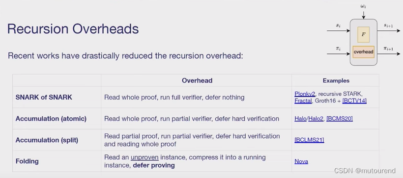

# 聚合证明

在零知识证明体系里，聚合证明是把多个零知识证明合并成一个更简洁证明的技术，以此降低存储和验证成本，在涉及大量证明的场景（如区块链交易验证、分布式系统数据一致性验证）中至关重要。其原理主要基于以下方面：
* 同态性质运用：零知识证明具备同态性质，即在不泄露证明具体内容的情况下，可对证明开展特定数学运算。以两个零知识证明 $P_1$ 和 $P_2$ 为例，若它们满足同态关系，就能借助特定算法将二者聚合为新证明 $P_new$，且 $P_new$ 能用来验证 $P_1$和 $P_2$ 所代表计算结果的正确性 。比如在一些基于椭圆曲线密码学的零知识证明中，利用椭圆曲线的同态特性对证明进行聚合操作。
* 线性组合与压缩：常采用线性组合的手段处理多个证明。具体做法是选择合适系数，对多个证明进行线性组合从而得到新证明。新证明保留了原有证明的关键信息，同时实现了证明的压缩。在有多个节点的分布式系统中，各个节点都有自身的证明，通过线性组合方式聚合这些证明，能将众多节点的证明压缩成一个统一证明，方便进行整体验证 。
* 递归聚合：针对多个证明的聚合，可采用递归方式。先对部分证明进行聚合得到中间结果，再将中间结果与其余证明继续聚合，不断重复该过程，直至最终得到一个简洁的证明 。这种递归方式能高效处理大规模的证明集合，提升证明处理效率 。

### 以 Halo2 为例介绍聚合证明
* 基于多项式承诺方案：Halo2 使用的多项式承诺方案为 Inner product argument（内积论证） 。它利用离散对数等技术，对单变量多项式进行多项式承诺的相关计算。在证明过程中，通过对多项式承诺的操作来实现对多个证明的聚合。例如，借助二分法递归调用思想，在每一轮计算 evaluation proof（求值证明） 。这种方式为聚合证明提供了基础的密码学保障，使得不同的证明可以在多项式承诺的框架下进行关联和整合。
* 递归证明组合（recursive proof composition） ：这是 Halo2 实现聚合证明的重要手段。它可以将大量独立创建的 proofs（证明）进行有效地组合。具体来说，通过一种特殊的构造，将多个证明逐步整合，最终使得大量证明的验证时间与验证一个单独证明的时间相当。例如，在一个包含众多子电路证明的场景中（类似 zkevm 中包含 evm 电路、ram 电路、存储电路等多种子电路证明 ） ，Halo2 可以利用递归证明组合技术，把这些子电路的证明聚合起来，形成一个统一的证明，方便在区块链等场景中进行整体验证 。
* 利用同态性质：Halo2 利用零知识证明的同态性质来处理证明聚合。对于多个满足一定同态关系的证明，通过特定算法将它们进行组合操作。在这个过程中，不泄露证明的具体内容，同时保证聚合后的证明能够验证原始多个证明所代表的计算结果的正确性 。

Halo2 是一个用于构建零知识证明系统的工具包，在聚合证明方面有独特实现方式：
* 无需可信设置：Halo2 无需像一些传统零知识证明框架那样依赖可信设置。传统可信设置可能存在安全隐患（如设置过程中的密钥泄露风险），Halo2 规避了这一问题，从基础层面保障了证明的安全性和可靠性，为聚合证明的应用提供了更稳健的环境 。
* 组件化设计：它采用组件化的设计思路，各个模块可独立优化以满足具体密码学需求。这种设计让 Halo2 在处理聚合证明时更具灵活性和高效性。不同的零知识证明任务可以根据自身特点调用合适的组件进行处理，之后再将这些处理后的证明进行聚合 。
* 支持递归证明：Halo2 支持递归证明特性，这对聚合证明意义重大。递归证明可将庞大的计算任务分解为多个更小阶段，然后以链式方式整合各阶段的证明 。在聚合证明场景中，这意味着可以先对小规模的证明集合进行递归聚合，逐步扩大聚合规模，最终高效地将大量证明聚合为一个简洁证明，极大提升了验证效率 。例如在复杂的区块链跨链交易场景中，涉及多个不同链上的交易证明，Halo2 可通过递归证明的方式，将这些证明逐步聚合，使得验证者能够快速验证所有交易的有效性，同时又不会泄露交易的敏感信息 。

# 递归证明
# ivc方案对比
1. SNARK of SNARK：Verifier会读取整个proof，并验证整个proof，无任何延缓操作。【每个step都需要读取完整的proof，并验证完整的proof。】
* SNARK of SNARK代表方案有：
    * Plonky2：为recursive STARK。$2^{12}$ 个gate，不过为wide gate——width of 135 (Goldilocks) elements，且conjectured FRI soundness约为100 bits。
    * Fractal：为Groth16 + [BCTV14]（2013年论文Succinct Non-Interactive Zero Knowledge for a von Neumann Architecture）。Fractal很昂贵，有约百万级的R1CS约束。
2. Accumulation（atomic）（原子式累加）：Verifier会读取整个proof，但只验证部分，会将hard part的验证累加推迟，即递归n次，仅需要对hard part做一次验证。【每个step都需要读取完整的step，并做部分验证，在最后一个step需对hard part进行一次验证即可。】
* Accumulation（atomic）（原子式累加）代表方案有：
    * Halo/Halo2 以及 [BCMS20]（对应2020年论文Proof-Carrying Data from Accumulation Schemes）：约束数为数十万——优于SNARK of SNARK的百万级约束。
3. Accumulation（split）（切分累加）：Verifier会读取部分proof，但只验证部分，会将hard part的验证累加推迟，即递归n次，仅需在最后读取一次完整的proof，并对hard part做一次验证。【每个step仅需读取部分proof，并做部分验证，仅需在最后一个step读取一次完整的proof，并执行一次hard part验证。】
* Accumulation（split）（切分累加）代表方案有：
    * [BCLMS21]对应2020年论文Proof-Carrying Data without Succinct Arguments：其牺牲了succinctness。
4. Folding：读取unproven instance，将其压缩为a running instance，对proving进行推迟。【每个step读取unproven instance，执行F来获得new running instance，只在最后一个step做证明】
* Folding代表方案有：
    * Nova：比之前方案的overhead开销要便宜很多，仅有约2万个约束。

# folding
random linear combination

引入随机值r ，random linear combination之后：
* Copy constraints仍然成立。
* gate equation为非线性的，会存在一些问题。

# sangria
https://blog.csdn.net/mutourend/article/details/130897692?spm=1001.2014.3001.5502