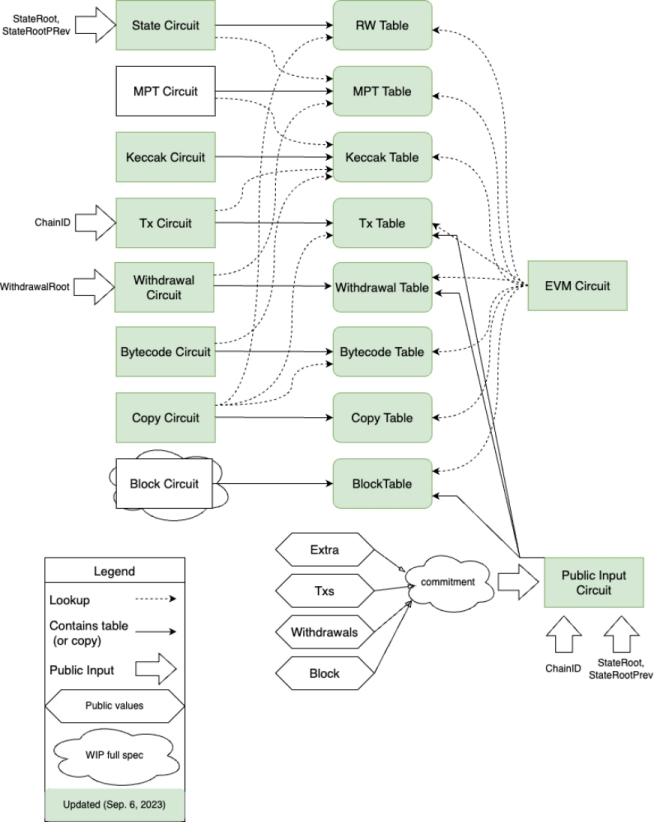
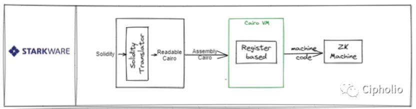
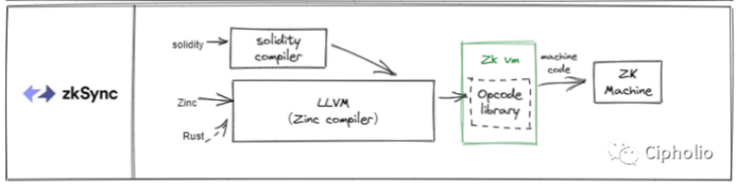
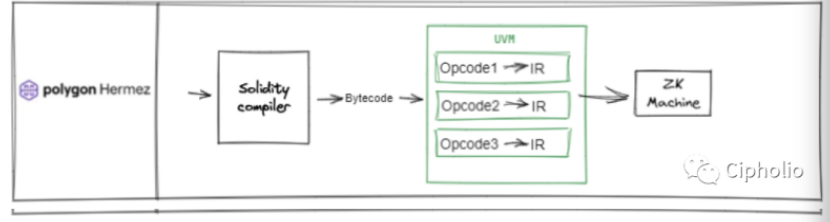
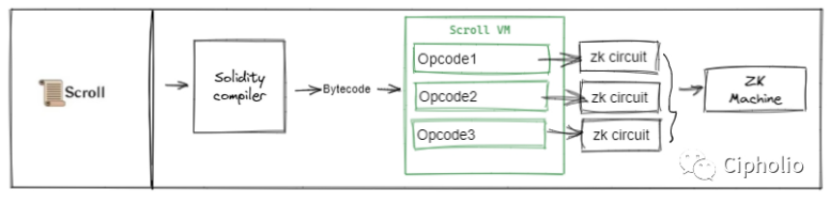

# evm
EVM主要由三部分组成：链的上下文StateDB环境、指令解释器Interpreter、Environment Function；作为独立的三部分，各自在运行虚拟机中运行中起着不同的作用。
* 链的上下文StateDB环境
    * 向EVM虚拟机提供链上数据支持，同时可以将合约执行过程中的需要存储的数据持久化至链上；例如：合约执行过程中账户余额的更新、合约账户内部状态的更新等。类似于通用计算机中的硬盘。
* 指令解释器Interpreter
    * 解释执行编译后合约字节码，与一般虚拟机不同的是，EVM执行中有Gas的概念，用来解决停机和资源消耗问题，所以在解释器执行指令时，也会对计算相应指令的Gas消耗。解释器依据PC调用相应的指令，从堆栈、内存中获取该指令所需的操作数；如果属于简单指令（如：算术ADD、比较指令GT...），则解释器直接计算相应指令的结果；如果属于EVM语义的指令（如：SSTORE、CALL），则将操作数与StateDB或Enviroment Function进行交互，计算指令结果，然后将结果存入堆栈。
* Environment Function(简写ENV FUNC)
    * 提供EVM特有指令的执行逻辑，使用指令的操作数、StateDB进行交互，计算执行结果（如：对于CALL指令，EVM先从堆栈中获取指令所需的操作数，将操作数和StateDB传入ENV FUNC，ENV FUNC使用自身的执行逻辑和传入数据，计算结果，返回给解释器）；

### 缺点
1. EVM 对椭圆曲线的支持有限；
2. EVM 的 word 大小是 256 位
3. EVM 有许多特殊的操作码
4. EVM 是基于堆栈的虚拟机
5. 以太坊存储布局带来了高昂的成本
6. 基于机器的证明带来了高昂的成本.
### 解决方法：
1. 使用多项式承诺（polynomial commitment）。
2. 查找表参数和自定义小工具的出现
3. 递归证明的可行性越来越高
4. 硬件加速正在提高证明效率

# zkevm
在 ZKEVM（零知识以太坊虚拟机）的实现中，一系列定制化电路模块构成了其核心基础设施。这些电路通过密码学证明技术，将复杂的 EVM 执行过程转化为可验证的多项式约束系统。以下是关键电路模块的技术解析：
### 核心状态管理电路
1. State 电路：作为 EVM 状态的随机访问存储器，分为三个子电路：
2. Stack 子电路：通过维护栈指针（SP）实现动态栈操作，约束 PUSH/POP 指令对栈空间的读写行为，确保操作前后的栈状态一致性。
3. Memory 子电路：跟踪 MLOAD/MSTORE 操作，将内存访问按全局计数器（GC）排序，构建包含操作地址、值和读写标记的布局，确保内存读写的时序正确性。
4. Storage 子电路：管理合约存储的持久化状态，通过键值对存储和哈希索引实现高效访问验证。
5. EVM 电路：处理 EVM 字节码的逐条执行，维护程序计数器（PC）和全局计数器（GC），验证每个指令对栈、内存和存储的操作是否符合协议规范。支持超过 99.5% 的官方 EVM 测试向量，确保与以太坊生态的兼容性。
### 密码学运算电路
1. Keccak256/Kaccak 电路：实现以太坊标准的哈希算法，用于交易签名验证、存储键生成等场景。
2. SHA256 电路：提供额外的哈希功能支持，满足特定安全需求。
3. EC 预编译电路：优化椭圆曲线加密运算，支持 ECDSA 签名验证和密钥生成。
4. ModExp 电路：高效处理大数模幂运算，用于智能合约中的复杂数学计算。
### 数据结构与协议电路
1. RLP 电路（FSM）：基于有限状态机实现递归长度前缀编码，验证交易数据的序列化格式。
2. MPT 电路：维护默克尔前缀树结构，确保账户状态和存储数据的完整性验证。
3. Poseidon 电路：采用新型哈希函数，支持高效的零知识证明生成，提升隐私保护能力。
### 交易与证明生成电路
1. Tx 电路：验证交易的有效性，包括签名、gas 限制和数据格式，确保每笔交易符合共识规则。
2. Root 电路：生成状态根哈希，确保区块间状态转换的可验证性。
3. Proof 聚合电路：将多个子电路生成的证明合并为最终的零知识证明，减少链上验证成本。
### 辅助优化电路
1. Copy 电路：优化数据复制操作，减少重复计算。
2. Bus-Mapping 模块：将 EVM 执行轨迹转换为结构化的见证数据，为电路提供输入。
3. Gadgets 抽象层：封装底层电路细节，提供可复用的验证组件，如范围检查、哈希验证等。

这些电路模块通过递归组合与分层验证，实现了 ZKEVM 的核心功能：在保持 EVM 字节码兼容性的前提下，将复杂计算转换为可验证的零知识证明。例如，每个交易执行轨迹经过 Bus-Mapping 处理后，由 State 电路验证状态一致性，再通过 Gadgets 验证密码学运算的正确性，最终由 Proof 聚合电路生成简洁的证明。这种设计既保证了计算正确性，又通过硬件加速和模块化优化提升了证明生成效率，使 ZKEVM 能够支撑高吞吐量的 Layer 2 应用场景。

### tips
Bus-mapping是设计的基础思想。一般的PC体系结构中，CPU通过总线访问存储（内存/硬盘），也就是计算和存储分开。zkEVM采用的同样的架构思想，状态的变化和指令的执行分开，并且分别由State proof和EVM proof进行证明。
State proof负责Bus Mapping信息的一致性和正确性。一致性指的Bus Mapping和State之间的读写一致。正确性指的是Bus Mapping中的读写状态正确。EVM proof负责EVM的op code的执行正确（如果涉及到State的op code，保证存储相关的操作正确）。

## zkevm方案的一些对比

