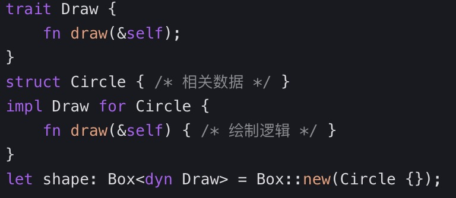
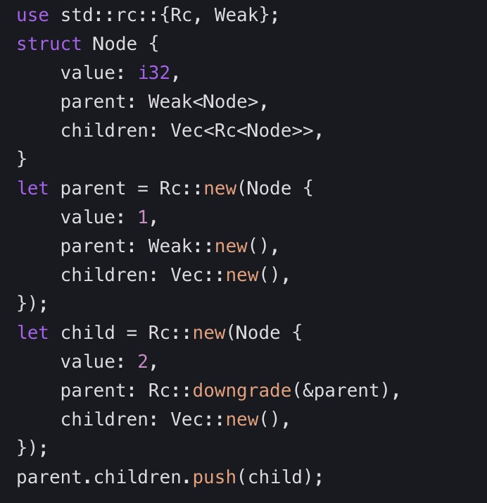
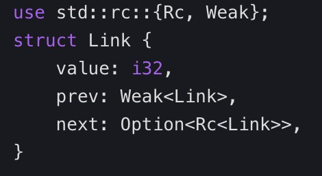
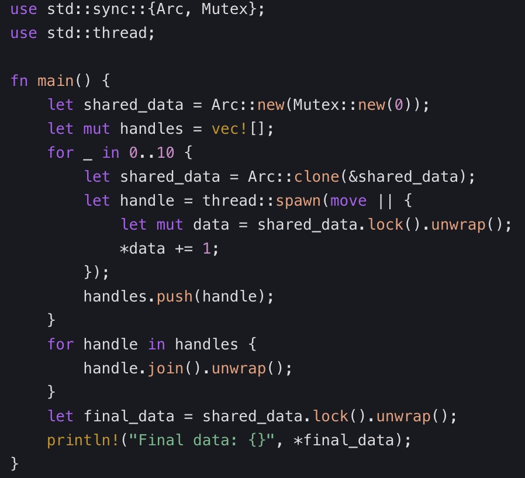

# rust面试
1. 解释 Rust 的所有权系统及其在内存安全方面的作用。
* Rust 的所有权系统无需垃圾回收器就能确保内存安全。其关键原则包括：
    * 单一所有者：每个值恰好有一个所有者。
    * 移动语义：在赋值或传递值时转移所有权。
    * 借用：通过引用（&T）进行临时访问。
    * 生命周期：确保引用的存活时间不超过其所引用的数据。

fn main() {  
    let s = String::from("hello");  
    let s2 = s; // Ownership of `s` moves to `s2`  
    // println!("{}", s); // Error: `s` is no longer valid  
}  

2. Rust 中的生命周期是什么，它是如何防止悬空指针的？
* 生命周期（'a）是一种注解，用于定义引用有效的作用域。编译器会强制要求引用的存活时间不超过其所引用的数据。

fn longest(s1: &str, s2: &str) -> &str {  
    if s1.len() > s2.len() {  
        s1  
    } else {  
        s2  
    }  
}  
// Error: Compiler can’t infer lifetimes for `s1` and `s2`  
Fix:

fn longest<'a>(s1: &'a str, s2: &'a str) -> &'a str {  
    // ...  
}  

3. 在 Rust 中，特征和泛型是如何协同工作的？
    * 泛型：定义占位类型（T）。
    * 特征：指定共享行为（例如 Display、Clone）。
    * 将它们结合起来，可以编写带有特征约束的泛型代码：

fn print<T: Display>(value: T) {  
    println!("{}", value);  
}  

4. 比较 Rust 中的 Result 和 Option
    * Option<T>：表示值的存在或缺失（Some/None）。
    * Result<T, E>：表示成功（Ok）或失败（Err）。
    * 使用 ? 运算符来传播错误

fn read_file() -> Result<String, io::Error> {  
    Ok(String::from("file content"))  
} 

5. Rust 如何安全地处理并发？
    * 线程：由操作系统管理的轻量级线程。
    * 通道：通过 std::sync::mpsc 进行安全的消息传递。
    * 互斥锁：用于共享数据的同步原语

use std::sync::mpsc;  
let (tx, rx) = mpsc::channel();  
std::thread::spawn(move || {  
    tx.send("Hello from thread!").unwrap();  
});  
println!("{}", rx.recv().unwrap());

6. Box<T>、Rc<T> 和 Arc<T> 之间有什么区别？
    * Box<T>：单所有者的堆分配。
    * Rc<T>：用于单线程环境下共享所有权的引用计数指针。
    * Arc<T>：线程安全的原子引用计数指针。

let shared = Arc::new(42);  
let clone = Arc::clone(&shared);  

7. 在 Rust 中，闭包是如何捕获其环境的？
    * 闭包可以从其作用域中捕获变量：
    * 移动闭包：获取所有权（move || ...）。
    * 不可变借用：捕获 &T。
    * 可变借用：捕获 &mut T。

let x = 42;  
let closure = || println!("{}", x);  
closure(); 

8. 解释 Rust 的迭代器系统及其优点。
    * 迭代器（Iterator 特征）以惰性方式处理序列。可以链式调用 map、filter 和 fold 等方法来编写富有表现力的代码。

let numbers = vec![1, 2, 3, 4];  
let sum: i32 = numbers.iter().sum();

9. 在 Rust 中，什么时候应该使用 unsafe?
    * 解引用原始指针（*const T、*mut T）。
    * 调用不安全的函数或方法。
    * 访问或修改静态变量

unsafe {  
    let raw_ptr = Box::into_raw(Box::new(42));  
    let value = *raw_ptr; // Unsafe: Dereference raw pointer  
    println!("{}", value);  
}  

10. 声明式宏和过程式宏有什么区别？
    * 声明式宏（macro_rules!）：基于模式匹配进行代码展开。
    * 过程式宏：通过 proc_macro 进行自定义代码生成。

macro_rules! greet {  
    ($name:expr) => {  
        println!("Hello, {}!", $name);  
    };  
}  
greet!("Alice"); // Output: Hello, Alice!  
  

11. Rust 的异步 / 等待机制在不使用线程的情况下是如何工作的？
    * 使用 tokio 运行时和 futures 来实现异步 I/O，而不会阻塞线程

12. From 特征在错误转换中起什么作用？
    * 实现 From 特征可以在不同的错误类型之间进行转换（例如 io::Error ↔ MyError）

13. 解释使用特征对象进行动态分发的原理
    * 特征对象（dyn Trait）允许在运行时实现多态

14. 智能指针与普通指针的区别是什么？
    * 普通指针只是单纯指向内存地址，不参与 Rust 的所有权系统，缺乏对其所指向资源的生命周期管理。而智能指针是结构体类型，在实现 Deref 和 Drop 特征的基础上，能够自动管理所指向资源的生命周期。例如，Box<T> 允许将数据分配到堆上，通过所有权转移来管理数据的生命周期；Rc<T> 通过引用计数机制，允许多个指针指向同一数据，只有当引用计数为 0 时才释放数据；Arc<T> 则用于多线程环境下，通过原子引用计数实现线程安全的数据共享。

15. Box<T> 的使用场景有哪些？
    * 在栈空间不足时：当数据量较大，栈空间无法满足存储需求时，可使用 Box<T> 将数据分配到堆上，减轻栈空间压力。例如，处理递归数据结构时，Box 可以避免栈溢出。以二叉树为例：

        * struct TreeNode {
            value: i32,
            left: Option<Box<TreeNode>>,
            right: Option<Box<TreeNode>>,
        }
    * 实现动态分发：通过 Box<dyn Trait>，可以在运行时确定具体调用哪个实现的方法，实现动态多态。如
    

16. Rc<T> 和 Arc<T> 的区别与适用场景是什么？
    * Rc<T> 通过引用计数来管理堆上的数据，允许多个 Rc 指针共享同一数据，当引用计数降为 0 时，数据被自动释放。但 Rc 不是线程安全的，因此仅适用于单线程环境。
    * 与之不同，Arc<T> 采用原子引用计数，确保引用计数的更新操作是线程安全的，所以适用于多线程环境下的数据共享。比如，在多线程服务器应用中，如果多个线程需要读取共享配置数据，就可以使用 Arc 来共享数据

17. Weak<T> 的作用是什么，如何与 Rc<T> 配合使用？
    * Weak<T> 是 Rc<T> 的弱引用，它不会增加所指向数据的引用计数，主要用于解决循环引用问题，同时避免在持有数据的强引用时，数据被意外释放,parent 对 child 持有强引用，child 对 parent 持有弱引用，从而避免了循环引用导致的内存泄漏。
    

18. 如何使用智能指针来解决循环引用问题？
    * 可以通过在循环引用链的一端使用 Weak<T> 来打破循环。以双向链表为例，每个节点包含指向前一个节点的弱引用和指向后一个节点的强引用
    
    在双向链表中，前一个节点对后一个节点使用 Rc 强引用，后一个节点对前一个节点使用 Weak 弱引用，这样既能保持链表结构，又能避免循环引用导致的内存管理问题

19. Mutex 和 RwLock 是什么，它们的主要作用是什么？
    * Mutex 即互斥锁，是一种同步原语，用于保证在同一时刻，只有一个线程能够访问被其保护的数据。这在多线程环境下，有效防止数据竞争，确保数据一致性。例如，多个线程对共享变量进行修改操作时，Mutex 能保证同一时间只有一个线程可以修改变量，避免数据冲突。
    * RwLock 是读写锁，它区分读操作和写操作。允许多个线程同时进行读操作，因为读操作不会修改数据，不会引发数据竞争；但只允许一个线程进行写操作，且在写操作进行时，不允许其他线程进行读或写操作。这使得 RwLock 在读取操作远多于写入操作的场景下，能显著提升并发性能。

20. Mutex 和 RwLock 在使用上有什么区别？
    * 在使用 Mutex 时，线程获取锁后，对保护数据拥有独占访问权，其他线程必须等待锁被释放才能获取。mutex.lock().unwrap();
    * 而使用 RwLock 时，读操作和写操作通过不同方法获取锁。读操作使用 read 方法，允许多个线程同时读取；写操作使用 write 方法，同一时间只允许一个线程进行写入。rwlock.write().unwrap();

21. 在哪些场景下应该优先使用 Mutex，哪些场景下应该优先使用 RwLock？
    * 当多线程对共享数据的操作以写操作为主，或者读写操作频率相近时，优先使用 Mutex。因为 RwLock 在写操作时，同样需要独占访问，且其内部实现相对复杂，会带来额外开销。例如，在一个多线程日志系统中，如果多个线程频繁写入日志，使用 Mutex 能更简单有效地保证数据一致性。
    * 当读操作远多于写操作时，优先使用 RwLock。以数据库缓存为例，多个线程可能频繁读取缓存数据，但只有在数据更新时才进行写操作。此时，RwLock 允许多线程同时读取，能大幅提升系统并发性能。

22. 如何避免 Mutex 和 RwLock 使用过程中的死锁问题？
    * 按照固定顺序获取锁：在多个线程需要获取多个锁时，所有线程都按照相同顺序获取锁，防止锁依赖形成环路。例如，线程 A 和线程 B 都需要获取 Mutex1 和 Mutex2，那么两个线程都先获取 Mutex1，再获取 Mutex2，就能避免死锁。
    * 使用 try_lock 方法：try_lock 方法尝试获取锁，如果锁不可用，立即返回 Err，而不会阻塞线程。线程可以根据返回结果决定后续操作，例如等待一段时间后再次尝试获取锁，或者执行其他任务。

23. MutexGuard 和 RwLockReadGuard、RwLockWriteGuard 是什么，有什么作用？
    * MutexGuard 是 Mutex 在获取锁后返回的类型，它实现了 Drop 特征，当 MutexGuard 离开作用域时，会自动释放锁。这确保了锁的正确管理，避免因代码异常或逻辑错误导致锁未被释放。
    * RwLockReadGuard 和 RwLockWriteGuard 分别是 RwLock 在进行读操作和写操作时返回的类型，同样实现了 Drop 特征。当它们离开作用域时，会自动释放相应的读锁或写锁，保证读写锁的正确使用和管理

24. 请简述 Rust 中多线程的实现方式，以及std::thread模块的主要功能
    * Rust 中多线程主要通过std::thread模块来实现。可以使用thread::spawn函数来创建新线程，该函数接受一个闭包作为参数，闭包中的代码会在新线程中执行。thread::current用于获取当前线程的句柄，thread::sleep用于让当前线程休眠指定的时间等

25. 什么是线程安全？在 Rust 中如何保证数据的线程安全？
    * 线程安全是指当多个线程同时访问某个共享资源（如数据结构或函数）时，不会出现数据竞争、不一致或其他未定义行为，能够保证程序的正确性和稳定性。
    * 在 Rust 中，保证数据线程安全的方式主要有以下几种：
        * 使用同步原语，如Mutex、RwLock等。它们可以控制对共享数据的访问，确保同一时刻只有一个线程能修改数据，避免数据竞争。
        * 利用 Rust 的所有权和借用规则。在多线程环境中，确保每个数据只有一个线程拥有其所有权，或者在共享数据时遵循不可变借用（多个线程可读）和可变借用（单个线程可写）的规则，防止数据被多个线程同时修改。
        * 使用Arc（原子引用计数）和Mutex或RwLock的组合。Arc可以在多个线程之间共享数据的所有权，配合同步原语来保证对共享数据的安全访问。

26. 请解释Arc<Mutex<T>>的作用，并举例说明如何使用
    * Arc<Mutex<T>>用于在多线程环境中安全地共享可变数据。Arc（Atomic Reference Counting）是一个原子引用计数类型，它允许将数据的所有权共享给多个线程。而Mutex用于提供互斥访问，确保同一时刻只有一个线程能够访问被Mutex包裹的数据。
    * 多个线程通过Arc<Mutex<T>>共享一个可变的整数，并对其进行累加操作，Mutex保证了数据的线程安全。
    

27. 请描述JoinHandle的作用，并说明如何使用它来等待线程执行完成
    * JoinHandle是std::thread::spawn函数返回的类型，它的作用是用于管理和等待一个线程的执行完成。每个JoinHandle对应一个创建出来的线程，通过调用JoinHandle的join方法，可以阻塞当前线程，直到对应的子线程执行完毕，然后获取子线程执行的结果

28. 如何解决借用检查器报错的问题，例如悬垂引用和数据竞争
    * 悬垂引用：悬垂引用是指引用指向的内存已经被释放。要解决这个问题，确保引用的生命周期足够长，不会在引用被使用之前释放其指向的数据。例如，避免从函数中返回局部变量的引用。
    * 数据竞争：数据竞争发生在多个线程或同一线程内多个引用同时访问和修改同一数据时。使用借用规则可以防止数据竞争，确保同一时刻只有一个可变引用或多个不可变引用。另外，在多线程环境中，可以使用同步原语如Mutex来保证数据访问的安全性。

29. 解释async和await语法的作用，说明异步任务的调度和执行原理。编写一个简单的异步函数，模拟网络请求，并在主函数中等待其完成
    * async和await语法的作用：
        * async关键字用于定义一个异步函数，该函数返回一个实现了Future trait 的类型。异步函数允许在函数体中使用await表达式，使函数能够暂停执行并将控制权交回给调用者，而无需阻塞线程。这使得程序可以在等待某些耗时操作（如网络请求、文件读写等）完成的同时，继续执行其他任务，提高了程序的并发性能和响应能力。
        * await表达式用于暂停异步函数的执行，直到其所等待的Future完成。当遇到await时，异步函数会暂停执行，将控制权返回给调用者，当Future完成后，异步函数会从暂停的地方继续执行，并获取Future的结果。
    * 异步任务的调度和执行原理：
        * 在 Rust 中，异步任务的调度通常依赖于一个运行时（如tokio）。运行时负责管理线程池、调度异步任务的执行以及处理任务之间的依赖关系。
        * 当一个异步函数被调用时，它返回一个Future。这个Future并不立即执行，而是在合适的时候由运行时进行调度。运行时会将Future放入一个任务队列中，当任务的前置条件满足（例如，await的Future完成）时，运行时会从任务队列中取出任务并执行。
        * await表达式的作用是暂停当前异步函数的执行，并将Future的控制权交还给运行时。运行时会继续调度其他可执行的任务，当被await的Future完成时，运行时会将控制权重新交回给暂停的异步函数，使其继续执行。

'static生命周期表示引用的生命周期从程序开始到结束

30. 声明式宏（macro_rules!）和过程式宏（包括自定义 derive 宏、属性宏、函数式宏）的特点和使用场景的答案
    * 声明式宏（macro_rules!）
    * 特点：
        * 基于模式匹配：通过定义一系列模式来匹配输入的代码片段，并根据匹配结果生成相应的代码。
        * 编译期展开：在编译阶段，编译器会将宏调用展开为实际的代码，不影响运行时性能。
        * 有限的代码生成能力：只能根据预先定义的模式进行代码生成，对于复杂的、动态的代码生成需求支持有限。
    * 使用场景：
        * 代码简化与复用：用于消除重复的代码结构，例如定义一组相似的函数或表达式，如日志记录宏log!(...)，可以方便地按照不同级别记录日志信息。
        * 条件编译代码生成：根据不同的编译配置或平台，生成不同的代码片段，如#[cfg(target_os = "linux")]等条件编译相关的宏定义。
        * 简单的数据结构初始化：可以用于简化数据结构的初始化过程，例如定义一个宏来快速初始化一个特定格式的结构体数组。
    * 过程式宏
    * 特点：
        * 更强大的代码生成能力：可以在编译期通过 Rust 代码动态地生成其他 Rust 代码，能够处理更复杂的代码生成逻辑。
        * 与编译器交互紧密：可以访问和操作编译器的内部数据结构，如语法树，从而实现对代码的深度分析和修改。
        * 需要单独的 crate 实现：过程式宏通常需要在一个单独的 crate 中实现，然后在主项目中引入使用。
    * 使用场景：
        * 自定义 derive 宏：用于为结构体或枚举自动推导实现特定的 trait，比如可以自定义一个derive(MyTrait)宏，让编译器为指定的类型自动生成MyTrait的实现代码，减少手动编写重复 trait 实现的工作量。
        * 属性宏：可用于为代码元素添加自定义属性，并根据这些属性在编译期执行特定的代码生成或修改操作，例如用于标记 API 路由的属性宏，或者用于代码分析和优化的自定义属性宏。
        * 函数式宏：能实现类似于函数的功能，但可以在编译期对输入的代码进行更灵活的处理和转换，比如可以实现一个函数式宏，根据输入的不同类型，生成不同的类型转换代码。