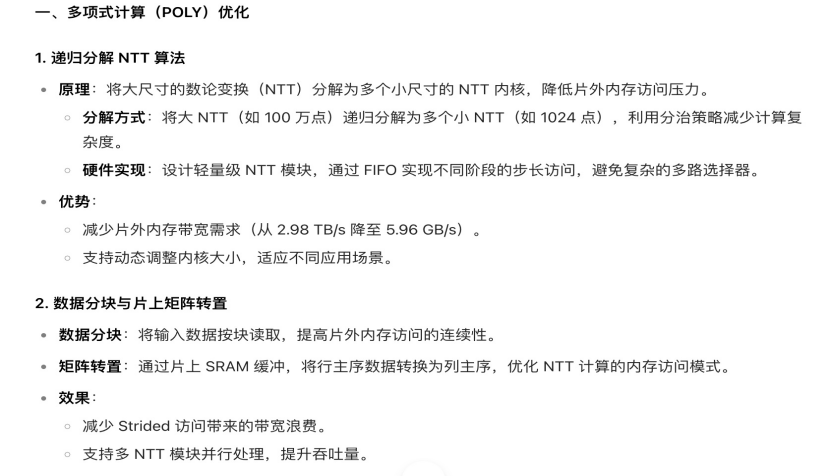

# fft

### FFT 硬件加速原理
1. 并行计算架构
    * SIMD 指令集：利用单指令多数据（SIMD）技术，如 NVIDIA GPU 的 CUDA 核心支持 128 位 / 256 位向量运算，将复数乘法分解为 4 - 8 个浮点操作同时执行。
    * 流水线处理：将 FFT 蝶形运算分解为多级流水阶段（如旋转因子乘法、加减法），每个阶段并行处理不同数据。
2. 内存层次优化
    * 分块处理：将大数组分割为 L1 缓存大小的块（如 16KB），减少全局内存访问次数。
    * 转置优化：通过共享内存实现原地转置，避免数据重复搬运。例如，在 2D - FFT 中，每个线程块处理一个子矩阵，利用共享内存完成行列交换。
3. 算法级并行
    * 多线程并行：每个 CUDA 线程负责独立的蝶形运算。对于 N = 2^m 点 FFT，启动 N 个线程并行处理。
    * 递归分治：将 FFT 分解为更小的子问题，如基 - 2、基 - 4 算法，结合硬件线程束（Warp）调度实现任务并行。
4. 专用硬件单元
    * Tensor Core 加速：NVIDIA A100 GPU 的 Tensor Core 可加速复数乘法，通过矩阵乘法指令实现 FFT 蝶形运算。
    * 缓存预取：硬件预取单元提前加载数据到 L2 隐藏内存延迟。

### FFT 优化
基 - 2 / 基 - 4 混合算法的优势，如何在 CUDA 中实现？
2D-FFT 转置优化的具体实现步骤（结合 Shared Memory 双缓冲）
* 步骤 1：数据加载
    * 将全局内存中的矩阵数据按块加载到共享内存的第一个缓冲区中。每个线程负责加载一个元素，确保数据的合并访问。
* 步骤 2：转置操作
    * 在共享内存中对第一个缓冲区的数据进行转置。这可以通过交换共享内存中元素的行和列索引来实现。
* 步骤 3：数据写入
    * 将转置后的数据从共享内存的第一个缓冲区写回到全局内存中。
* 步骤 4：双缓冲切换
    * 在第一个缓冲区进行转置和写入操作的同时，将下一块数据从全局内存加载到共享内存的第二个缓冲区中。
* 步骤 5：重复操作
    * 重复步骤 2 - 4，交替使用两个缓冲区，直到整个矩阵转置完成

### Performance Comparison:

| Method            | 2D-FFT Latency (RTX 4090) | Bandwidth Utilization |
| ----------------- | ------------------------- | --------------------- |
| Naive Transposition | 120 μs                    | 40%                   |
| Shared Memory     | 28 μs                     | 82%                   |
| Double Buffering  | 19 μs                     | 95%                   |

* 最佳实践：
    * 使用 32×32 的块大小以匹配 GPU 流式多处理器（SM）的能力
    * 结合 CUFFT 库的内置转置功能以实现最佳性能
    * 优先使用共享内存的静态分配方式以最小化运行时开销

## 算法选择
    * 小点数（N<1024）：基 - 4 / 基 - 8 混合算法。
    * 大点数（N>1024）：分治 FFT 结合混合基算法。
    * 2D-FFT：转换为行 / 列两次 1D-FFT，利用转置优化。

## 基 - 4 / 基 - 8 混合 FFT 算法原理
* 基 - 4 算法核心
    * 分解方式：将 N 点序列分为 4 个子序列，递归分解为 N/4 点 FFT
    * 蝶形运算：每个基 - 4 阶段包含 3 次复数乘法（比基 - 2 减少 50% 乘法次数）
    * 旋转因子：使用 ω^k = e^(-2πi k/N)，k=0,1,2,3
* 分治架构设计
    * 递归终止条件：当子问题规模≤32 时切换为基 - 2 或基 - 4 算法
    * 任务划分：将大 N 点 FFT 分解为多个子任务（如 N=2048 → 4×512 点 FFT）
    * 流水线处理：前序分解阶段与后序合并阶段并行执行
    * 线程分配：每个子任务分配独立的线程块（Block）
    * 寄存器重用：通过寄存器文件存储中间结果，减少共享内存访问
    * 分支预测优化：利用条件编译消除冗余分支（如使用#ifdef RADIX_8）2D-FFT 转置优化技术
* 行列分解策略
    * 行处理阶段：对每一行独立执行 1D-FFT
    * 矩阵转置：将行优先存储转换为列优先
    * 列处理阶段：对每一列执行 1D-FFT
    * 逆转置：恢复原始存储顺序
* 转置优化实现
    * 共享内存分块：将大矩阵划分为 32×32 子块，每个线程块处理一个子块
    * 双缓冲技术
* 关键技术挑战
    * 动态负载均衡：分治策略需根据硬件状态动态调整任务分配
    * 混合精度支持：在低精度计算中保持数值稳定性（如使用 FP16+FP32 混合精度）
    * 跨平台适配：需针对不同 GPU 架构（如 Ampere vs Hopper）优化旋转因子表

## NTT（数论变换）技术方案与优化思路
1. 技术方案
    * 算法原理： 基于 4 步递归算法，将 224 点 NTT 分解为多个 212 点 NTT，通过列和行变换实现：
        * 矩阵布局：将 224 点排列为 212×212 矩阵（行主序）。
        * 列 NTT：对每列执行 212 点 NTT。
        * Twiddle 因子乘法：修正列变换后的结果。
        * 行 NTT：对每行执行 212 点 NTT，隐式转置矩阵。
    * 硬件实现：
        * 并行内核：支持 8/16/32/64 核心，每个核心处理 212 点 NTT。
        * 流水线结构：使用 AXI 流传输数据，HLS 内核调度 PCIe 和 HBM 访问。
        * 动态内存访问：通过预 / 后处理优化 HBM 带宽，支持 2048-4096 字节突发传输。
2. 优化思路
    * 递归分解：
        * 将大 NTT 分解为小内核，降低片外内存带宽需求（从 2.98 TB/s 降至 5.96 GB/s）。
    * 数据分块与转置：
        * 片上 SRAM 缓冲数据，减少 Strided 访问。
        * 通过主机预处理实现优化内存布局，提升 HBM 带宽利用率。
    * 流水线并行：
        * 多核心并行处理列 / 行变换，掩盖计算与传输延迟。
    * 硬件资源高效利用：
        * 每个核心使用分布式 RAM 和蝶形单元，减少路由复杂度。
        * 优化 Twiddle 因子生成，降低乘法器资源消耗。
    * 特殊值处理：
    * 支持不同窗口大小（如 212 点），灵活适应不同场景。

