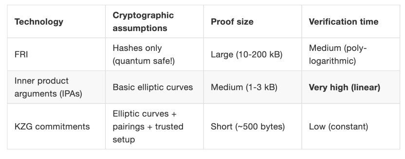

# kzg、fri、ipa的区别

| 多项式承诺方案 | KZG10                                                                 | IPA                                      | FRI                              | DARKS                                      |
|----------------|-----------------------------------------------------------------------|------------------------------------------|----------------------------------|--------------------------------------------|
| 底层技术       | 双线性对群                                                           | 离散对数群                               | 哈希函数                         | 未知阶群                                   |
| 设置           | $G_1、G_2$ 群 $g_1、g_2$ 生成元 $e$ 配对函数 sk（$F$ 中的秘密值） | $G$ 椭圆曲线 $g^n$（$G$ 中独立元素） | $H$ 哈希函数 $w$ 单位根             | $N$ 未知阶 $g$（$N$ 中随机值） $q$ 大整数 |
| 承诺           | $(a_0s_0 + \dots + a_ns_n)g_1$                                        | $a_0g_0 + \dots + a_ng_n$               | $H(f(w_0), \dots, f(w_n))$       | $(a_0q_0 + \dots + a_dq_d)g$              |

 
| 特性          | FRI       | KZG   | IPA     | DARK(RSA) | DARK(Class) |
|---------------|-----------|-------|---------|-----------|-------------|
| **透明性**    | yes       | no    | yes     | no        | yes         |
| **简洁性**    | yes       | yes   | no      | yes       | yes         |
| **后量子安全** | yes       | no    | no      | no        | no          |

* 说明

    * Transparent（透明性）：在零知识证明相关语境下，指无需可信设置（trusted setup） 。可信设置是在某些零知识证明系统中，初始化时需要一个受信任的第三方来生成公共参考参数，而具有透明性的系统不依赖这种受信任的初始化过程，避免了因信任第三方带来的潜在安全风险。
    * succinct（简洁性）：表示证明的大小（规模）相对较小，并且验证证明所需的时间和资源也较少 。一个具有简洁性的零知识证明系统，能在较短时间内、以较低计算资源消耗完成证明验证，提升了系统的效率。
    * Post - quantum（抗量子性）：意味着该系统或协议所采用的加密技术或算法，在量子计算机环境下依然能保持安全性 。随着量子计算技术发展，传统基于某些数学难题（如大整数分解、离散对数问题）的加密算法可能被量子算法快速破解，具备抗量子性的系统则能抵御这种威胁。
* FRI：具有透明性，无需可信设置；具备简洁性，证明规模小且验证高效；具有抗量子性，在量子计算环境下安全性有保障。
* KZG：不具备透明性，需要可信设置；具有简洁性，能高效进行证明和验证；不具有抗量子性，在量子计算环境下安全性可能受影响。
* IPA：具有透明性，无需可信设置；不具备简洁性，证明规模或验证效率可能欠佳；不具有抗量子性，难以抵御量子计算攻击。
* DARK(RSA) ：不具备透明性，需要可信设置；具有简洁性，可实现高效证明与验证；不具有抗量子性，RSA 算法易受量子计算威胁。
* DARK(Class) ：不具备透明性，需要可信设置；具有简洁性，证明和验证较为高效；不具有抗量子性，面对量子计算缺乏安全性保障。

| **特性**       | **FRI**          | **KZG** | **IPA**         | **DARK**        |
|----------------|------------------|---------|-----------------|-----------------|
| **Proof size** | $O(\log_2 d)$ | $O(1)$ | $O(\log d)$ | $O(\log d)$ |
| **Verify time** | $O(\log_2 d)$ | $O(1)$ | $O(\log d)$ | $O(d)$     |
| **Prove time** | $O(d \cdot \log_2 d)$ | $O(d)$ | $O(d)$     | $O(d)$     |

