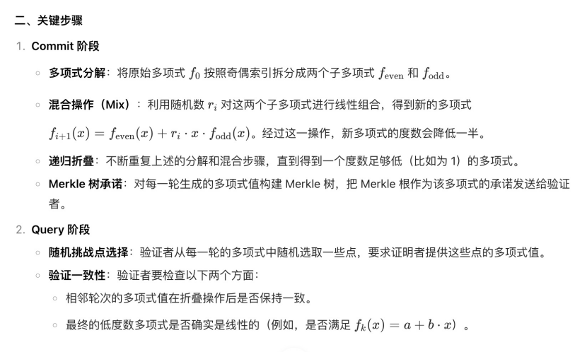
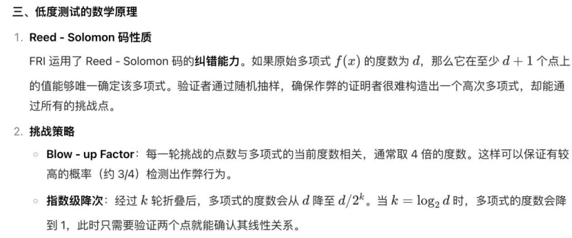
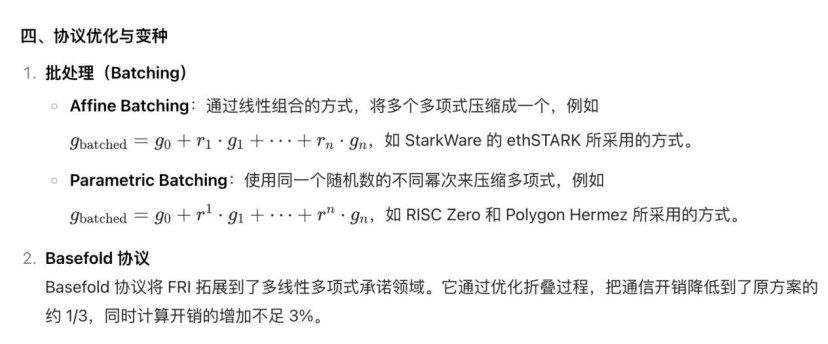

# fri
FRI（Fast Reed - Solomon Interactive Oracle Proofs of Proximity）低度多项式实现原理
一、目标与核心思想
FRI 的主要目标是高效证明某个多项式是低度数的，具体来说，是让验证者（Verifier）能够通过少量查询，确认证明者（Prover）所承诺的多项式的度数不超过某个给定值 d。其核心思路如下：
* 递归折叠（Recursive Folding）：把原始多项式逐步拆分成更小的子多项式，使每次折叠后多项式的度数减半。
* 随机挑战（Random Challenges）：验证者随机挑选一些点，要求证明者提供这些点对应的多项式值，以此来检验多项式是否满足低度数的条件。
* Merkle 树承诺（Merkle Tree Commitment）：借助 Merkle 树对多项式的值进行承诺，保证在验证过程中数据不会被篡改。

